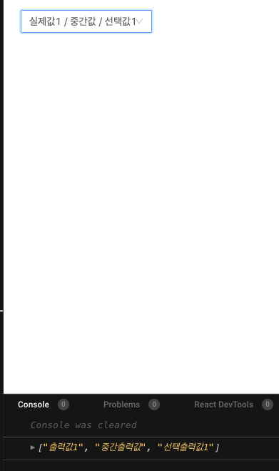
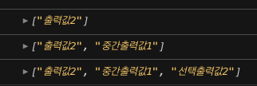
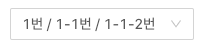

### DataEntry

#### Cascader

- 케스케이더는 선택박스입니다.
- 고정된 값들중 선택을 해야할 경우 사용됩니다.
- 큰 데이터에서는 여러단계로 나누어서 선택을 제시하면 쉽게 할 수 있습니다.
- float layer로 하여 아이템을 나누면 사용자들이 이용하기 편리합니다.

---

```js
import { Cascader } from 'antd';

const options = [
  {
    value: '출력값1',
    label: '실제값1',
    children: [
      {
        value: '중간출력값',
        label: '중간값',
        children: [
          {
            value: '선택출력값1',
            label: '선택값1',
          },
        ],
      },
    ],
  },
  {
    value: '출력값2',
    label: '실제값2',
    children: [
      {
        value: '중간출력값1',
        label: '중간값1',
        children: [
          {
            value: '선택출력값2',
            label: '선택값2',
          },
        ],
      },
    ],
  },
];

ReactDOM.render(
  <Cascader options={options} onChange={(value) => console.log(value)} />,
  document.getElementById('container'),
);
```



### API

#### allowClear

- 입력한 값을 제거해주는 버튼을 추가합니다.
- Type : boolean
- default : true

```js
import { Cascader } from 'antd';

ReactDOM.render(
  <Cascader options={options} allowClear />,
  document.getElementById('container'),
);
```

#### autoFocus

- Cascader에 시작시 포커스 됩니다.
- Type : boolean
- default : false

```js
import { Cascader } from 'antd';

ReactDOM.render(
  <Cascader options={options} autoFocus />,
  document.getElementById('container'),
);
```

#### borderd

- 테두리를 삭제,삽입이 가능합니다.
- Type : boolean
- default : true

```js
import { Cascader } from 'antd';

ReactDOM.render(
  <Cascader options={options} borderd={false} />,
  document.getElementById('container'),
);
```

#### changeOnSelect

- 각 단계에서 값이 선택될때 true값으로 반환이 됩니다.
- 자세하게 분류를 구별할 수 있습니다.
- Type : boolean
- default : false

```js
import { Cascader } from 'antd';

ReactDOM.render(
  <Cascader
    options={options}
    onChange={(value) => console.log(value)}
    changeOnSelect
  />,
  document.getElementById('container'),
);
```



#### className

- cascader의 클래스명을 지정할 수 있습니다.
- Type : string
- default : -

```js
import { Cascader } from 'antd';

ReactDOM.render(
  <Cascader options={options} className={'casecaderClassName'} />,
  document.getElementById('container'),
);
```

#### defaultValue

- 내부에 default값을 설정할 수 있습니다.
- value값을 입력합니다. 클라이언트 페이지에서는 label값으로 출력됩니다.
- Type : string[]|number[]
- default : []

```js
import { Cascader } from 'antd';

const options = [
  {
    value: '1',
    label: '1번',
    children: [
      {
        value: '1-1',
        label: '1-1번',
        children: [
          {
            value: '1-1-1',
            label: '1-1-1번',
          },
          {
            value: '1-1-2',
            label: '1-1-2번',
          },
        ],
      },
    ],
  },
  {
    value: '2',
    label: '2번',
    children: [
      {
        value: '2-1',
        label: '2-1번',
        children: [
          {
            value: '2-1-1',
            label: '2-2번',
          },
        ],
      },
    ],
  },
];

ReactDOM.render(
  <Cascader defaultValue={['1', '1-1', '1-1-2']} options={options} />,
  document.getElementById('container'),
);
```



#### disabled

- 선택및 수정을 불가능하게 합니다.
- Type : boolean
- default : false

```js
import { Cascader } from 'antd';

ReactDOM.render(
  <Cascader disabled options={options} />,
  document.getElementById('container'),
);
```

#### displayRender

- 선택하는 환경에서 선택되어진 옵션을 확인할 수 있습니다.
- Type : (label,selectedOptions)=>ReactNode
- default : label => label.join(/)

```js
import { Cascader } from 'antd';

ReactDOM.render(
  <Cascader
    options={options}
    displayRender={(label, selectedOptions) => {
      console.log(label, selectedOptions);
    }}
  />,
  document.getElementById('container'),
);
```

```
["1번", "1-1번", "1-1-1번"]
[Object, Object, Object]
```

응용

```js
import { Cascader } from 'antd';
const options = [
  {
    value: 'item1',
    label: 'item1',
  },
  {
    value: 'item2',
    label: 'item2',
  },
  {
    value: 'item3',
    label: 'item3',
  },
  {
    value: 'item4',
    label: 'item4',
  },
  {
    value: 'item5',
    label: 'item5',
    children: [
      {
        value: 'item5-1',
        label: 'item5-1',
      },
      {
        value: 'item5-2',
        label: 'item5-2',
        children: [
          {
            value: 'item5-2-1',
            label: 'item5-2-1',
            code: '102020',
          },
          {
            value: 'item5-2-2',
            label: 'item5-2-2',
          },
        ],
      },
      {
        value: 'item5-3',
        label: 'item5-3',
      },
      {
        value: 'item5-4',
        label: 'item5-4',
      },
    ],
  },
];

function handleAreaClick(e, label, option) {
  e.stopPropagation();
  console.log('clicked', label, option);
}

const displayRender = (labels, selectedOptions) =>
  labels.map((label, i) => {
    const option = selectedOptions[i];
    if (i === labels.length - 1) {
      return (
        <span key={option.value}>
          {label} (
          <a onClick={(e) => handleAreaClick(e, label, option)}>
            {option.code}
          </a>
          )
        </span>
      );
    }
    return <span key={option.value}>{label} / </span>;
  });
class LoadData extends React.Component {
  render() {
    return (
      <Cascader
        options={options}
        displayRender={displayRender}
        style={{ width: '100%' }}
      />
    );
  }
}

ReactDOM.render(<LoadData />, document.getElementById('container'));
```

#### expandTrigger

- 값을 선택할때 click,hover중 선택할 수 있습니다.
- Type : string
- default : click

```js
import { Cascader } from 'antd';

ReactDOM.render(
  <Cascader options={options} expandTrigger={'hover'} />,
  document.getElementById('container'),
);
```

#### expandIcon

- 값을 선택하는곳의 아이콘이 변경됩니다.
- Type : ReactNode
- default : - (>)
- version : 4.4.0

```js
import { Cascader } from 'antd';
import { SearchOutlined } from '@ant-design/icons';

ReactDOM.render(
  <Cascader expandIcon={<SearchOutlined />} options={options} />,
  document.getElementById('container'),
);
```

#### fieldNames

- option에 넣은 label,value,children의 값들을 변경할 수 있습니다.
- Type : object
- default : {label:label,value:value,children:children}

```js
import { Cascader } from 'antd';

ReactDOM.render(
  <Cascader
    fieldNames={{ label: 'value', value: 'label', children: 'children' }}
    options={options}
  />,
  document.getElementById('container'),
);
```

#### getPopupContainer

- selector를 렌더링 해야하는 부모노드 입니다.
- 기본값은 `document.body`입니다.
- 스크롤이 가능한 컨텐츠로 수정이 필요하면 relative position으로 설정해야합니다.
- Type : function(triggerNode)
- default : ()=>document.body

#### loadData

- 선택한 값을 느리게 출력할 수 있습니다. 비동기 작업을 처리할 수 있게 해줍니다.
- showSearch랑 같이 사용할 수 없습니다.
- Type : (selectedOptions) => void
- default : -

```js
import { Cascader } from 'antd';
const options = [
  {
    value: '1',
    label: '1번',
  },
  {
    value: '2',
    label: '2번',
  },
];
class LoadData extends React.Component {
  state = {
    options,
  };

  loadData = (selectedOptions) => {
    const targetOption = selectedOptions[selectedOptions.length - 1];
    targetOption.loading = true;

    setTimeout(() => {
      targetOption.loading = false;
      targetOption.children = [
        {
          label: `${targetOption.label}로딩후 생성1`,
          value: 'loadingData1',
        },
        {
          label: '로딩후 생성2',
          value: 'loadingData2',
        },
      ];
      this.setState({
        options: [...this.state.options],
      });
    }, 1000);
  };
  render() {
    return <Cascader loadData={this.loadData} options={options} />;
  }
}

ReactDOM.render(<LoadData />, document.getElementById('container'));
```

#### notFoundContent

- 결과값과 같은값이 없을때 사용됩니다
- Type : string
- default : Not Found

#### options

- cascasder에 들어갈 값들을 설정할 수 있습니다.
- 단계별로 부모,자식관계를 가지며 부모 다음단계로 자식을 선택할 수 있습니다.
- Type : Option[]
- default : -

```
interface Option {
  value: string | number;
  label?: React.ReactNode;
  disabled?: boolean;
  children?: Option[];
}
```

#### placeholder

- HTML의 `input placeholder` 과 똑같은 기능을 합니다.
- input범위 내에 해당 영역에 대한 설명을 작성할 수 있습니다.
- Type : string
- default : Please select

```js
import { Cascader } from 'antd';

ReactDOM.render(
  <Cascader placeholder="해당지역을 선택해주세요" options={options} />,
  document.getElementById('container'),
);
```

#### popupClassName

- Type : string
- default : -

#### popupPlacement

- 선택할수 있는 팝업의 위치를 선택할 수 있습니다.
- Type : string(bottomLeft | bottomRight)
- default : bottomLeft

```js
import { Cascader } from 'antd';

ReactDOM.render(
  <Cascader popupPlacement={'bottomRight'} options={options} />,
  document.getElementById('container'),
);
```

#### popupVisible

- 컴포넌트 실행후 계속 아래의 팝업이 열린 상태로 고정이 됩니다.
- 지정되면 해당 값을 false로 하지 않으면, 값을 선택해도 팝업은 고정되어 있습니다.
- Type : boolean
- default : -

```js
import { Cascader } from 'antd';

ReactDOM.render(
  <Cascader popupPlacement={'bottomRight'} options={options} />,
  document.getElementById('container'),
);
```

#### showSearch

- 내부의 label을 기준으로 값을 검색할 수 있습니다.
- Type : boolean | object
- default : false
- 참조 : [API - showSearch](###API-ShowSearch)

```js
import { Cascader } from 'antd';
const options = [
  {
    value: '1',
    label: '1번',
    children: [
      {
        value: '1-1',
        label: '1-1번',
      },
      {
        value: '1-2',
        label: '1-2번',
      },
    ],
  },
  {
    value: '2',
    label: '2번',
    children: [
      {
        value: '2-1',
        label: '2-1번',
      },
      {
        value: '2-2',
        label: '2-2번',
      },
    ],
  },
];

function filter(inputValue, path) {
  return path.some(
    (option) =>
      option.label.toUpperCase().indexOf(inputValue.toUpperCase()) > -1,
  );
}
class LoadData extends React.Component {
  render() {
    return <Cascader options={options} showSearch={{ filter }} />;
  }
}

ReactDOM.render(<LoadData />, document.getElementById('container'));
```

#### size

- input태그의 사이즈를 조절할 수 있습니다.
- Type : large | middle | small
- default : -

```js
import { Cascader } from 'antd';

ReactDOM.render(
  <Cascader size={'small'} options={options} />,
  document.getElementById('container'),
);
```

#### style

- input태그의 스타일을 바꿀 수 있습니다.
- Type : CSSProperties
- default : -

```js
import { Cascader } from 'antd';

ReactDOM.render(
  <Cascader
    style={{ width: '200px', backgroundColor: 'magenta' }}
    options={options}
  />,
  document.getElementById('container'),
);
```

#### suffixIcon

- input태그의 우측에 들어갈 아이콘을 수정할 수 있습니다.
- Type : ReactNode
- default : -

```js
import { Cascader } from 'antd';
import { SearchOutlined } from '@ant-design/icons';

ReactDOM.render(
  <Cascader suffixIcon={<SearchOutlined />} options={options} />,
  document.getElementById('container'),
);
```

#### value

- defaultValue와 동일하지만 값을 변경할 수 없습니다.
- Type : string[]|number[]
- default : -

```js
import { Cascader } from 'antd';
import { SearchOutlined } from '@ant-design/icons';

ReactDOM.render(
  <Cascader value={['cant', 'change', 1]} options={options} />,
  document.getElementById('container'),
);
```

#### dropdownRender

- dropdown아래부분에 추가로 무언가를 넣어줄 수 있습니다.
- Type : (menus: ReactNode)=>ReactNode
- default : -
- version : 4.4.0

```js
import { Cascader, Divider } from 'antd';

function RenderDropdown(menues) {
  return (
    <div>
      {menues}
      <Divider
        style={{ backgroundColor: 'red', width: '5px', margin: '0px' }}
      />
      <div style={{ padding: 2 }}>독도,울릉도는 경북에 있습니다.</div>
    </div>
  );
}
class LoadData extends React.Component {
  render() {
    return <Cascader options={options} dropdownRender={RenderDropdown} />;
  }
}

ReactDOM.render(<LoadData />, document.getElementById('container'));
```

#### onChange

- 값이 선택되면 input값이 변경이 될때 실행됩니다.
- Type : (value,selectedOptions) => void
- default : -

```js
import { Cascader } from 'antd';

ReactDom.render(<Cascader options={options} onChange={(value,selectedOptions)=>{console.log(value,selectedOptions)})/>, document.getElementById('container'));
```

#### onPopupVisibleChange

- 팝업을 보여질때와 안보여질때 값을 반환합니다.
- 보여지면 true, 선택되거나 닫히면 false를 반환합니다.
- Type : (value(boolean)) => void
- default : -

```js
import { Cascader } from 'antd';

ReactDom.render(<Cascader options={options} onPopupVisibleChange={(value)=>{console.log(value)})/>, document.getElementById('container'));
```

---

### API-showSearch

#### filter

- 특정 조건을 만족하는 값들만 반환하기 위해서 사용됩니다.
- inputValue와 path 2개의 값을 반환합니다.
- true,false 두개로 값이 반환됩니다.
- Type : function(inputValue,path) : boolean
- default : -

```js
import { Cascader } from 'antd';
const options = [
  {
    value: 'A',
    label: '10대',
    children: [
      {
        value: 'A-1',
        label: '10',
      },
      {
        value: 'A-2',
        label: '15',
      },
    ],
  },
  {
    value: 'B',
    label: '20대',
    children: [
      {
        value: 'B-1',
        label: '20',
      },
      {
        value: 'B-2',
        label: '25',
      },
    ],
  },
];

function filter(inputValue, path) {
  return path.some((option) => parseInt(option.label, 10) + 10 > 30);
}
class LoadData extends React.Component {
  render() {
    return (
      <Cascader
        options={options}
        showSearch={{ filter }}
        placeholder="해당지역을선택해주세요"
      />
    );
  }
}

ReactDOM.render(<LoadData />, document.getElementById('container'));
```

#### limit

- 검색시 출력되는 값의 갯수를 제한할 수 있습니다.
- Type : number
- default : 50

```js
import { Cascader } from 'antd';
import { SearchOutlined } from '@ant-design/icons';

ReactDOM.render(
  <Cascader showSearch={{ limit: 2 }} options={options} />,
  document.getElementById('container'),
);
```

#### matchInputWidth

- match되는 값을 출력할때 해당 값들의 길이를 지정할 수 있습니다.
- `false`는 해당 텍스트 길이만큼 출력이 가능하고, `true`는 해당 input태그의 길이만큼 출력되고 나머지는 잘려서 포현이됩니다.
- Type : boolean
- default : true

```js
import { Cascader } from 'antd';
import { SearchOutlined } from '@ant-design/icons';

ReactDOM.render(
  <Cascader showSearch={{ matchInputWidth: false }} options={options} />,
  document.getElementById('container'),
);
```

#### render

- filter option을 render할 수 있습니다.
- Type : function(inputValue,path): ReactNode
- default : -

#### sort

- 필터옵션을 정렬할 수 있습니다.
- Type : function(a,b,inputValue)
- default : -

---

### Method

#### blur()

#### focus()
