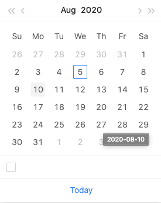

### DataEntry

- [API - Commom](###API-Common)
- [API - DatePicker](###API-DatePicer)
- [API - DatePicker[picker=year]](###API-DatePicker[picker=year])
- [API - DatePicker[picker=quarter]](###API-DatePicker[picker=quarter])
- [API - DatePicker[picker=month]](###API-DatePicker[picker=month])
- [API - DatePicker[picker=week]](###API-DatePicker[picker=week])
- [API - RangePicker](###API-RangePicker)

#### DatePicker

- 달력을 제공해줍니다.

---

### API-Common

- [Top](###DataEntry)
- [API - DatePicker](###API-DatePicer)
- [API - DatePicker[picker=year]](###API-DatePicker[picker=year])
- [API - DatePicker[picker=quarter]](###API-DatePicker[picker=quarter])
- [API - DatePicker[picker=month]](###API-DatePicker[picker=month])
- [API - DatePicker[picker=week]](###API-DatePicker[picker=week])
- [API - RangePicker](###API-RangePicker)

#### allowClear

- 입력한 값을 제거해주는 버튼을 추가합니다.
- Type : boolean
- default : true

```js
import { DatePicker } from 'antd';

ReactDOM.render(
  <DatePicker allowClear />,
  document.getElementById('container'),
);
```

#### autoFocus

- 컴포넌트 마운트시 DatePicker를 포커스합니다.
- Type : boolean
- default : false

```js
import { DatePicker } from 'antd';

ReactDOM.render(<DatePicker autoFocus />, document.getElementById('container'));
```

#### className

- 클래스명을 설정할 수 있습니다.
- Type : string
- default : -

```js
import { DatePicker } from 'antd';

ReactDOM.render(
  <DatePicker className={'DatePicker'} />,
  document.getElementById('container'),
);
```

#### dateRender

- DatePicker에 들어갈 셀 값들을 커스텀 렌더링 해줄수 있습니다.
- currentDate는 new Date()함수를 이용했을때 값입니다.
- today는 Date.now() 값입니다.
- Type : function(currentDate: moment, today: moment) => React.ReactNode
- default : -

```js
import { DatePicker } from 'antd';

ReactDOM.render(
  <>
    <DatePicker
      dateRender={(current) => {
        const style = {};
        if (current.date() === 1) {
          style.border = '1px solid #1890ff';
          style.borderRadius = '50%';
        }
        return (
          <div className="ant-picker-cell-inner" style={style}>
            {current.date()}
          </div>
        );
      }}
    />{' '}
  </>,
  document.getElementById('container'),
);
```

#### disabled

- DatePicker를 사용 불가능 상태로 만듭니다.
- Type : boolean
- default : false

```js
import { DatePicker } from 'antd';

ReactDOM.render(<DatePicker disabled />, document.getElementById('container'));
```

#### disabledDate

- dropdown 내부의 date를 선택을 막아줍니다.
- 지나간 시간이나 날을 사용하지 못할때 사용할 수 있습니다.
- Type : (currentDate: moment) => boolean
- defaut : -

```js
import moment from 'moment';
import { DatePicker } from 'antd';

const disabledDate = (current) => {
  return current && current < moment().endOf('day');
};

ReactDOM.render(
  <DatePicker disabledDate={disabledDate} />,
  document.getElementById('container'),
);
```

#### dropdownClassName

- 팝업으로 생성되는 달력의 클래스명을 지정할 수 있습니다.
- Type : string
- defaut : -

```js
import { DatePicker } from 'antd';

ReactDOM.render(
  <DatePicker dropdownClassName={'hello'} />,
  document.getElementById('container'),
);
```

#### getPopupContainer

- 컨테이너를 플로팅레이어로 설정해줍니다.
- `body`안의 `div`요소를 기본값으로 생성됩니다.
- Type : function(trigger)
- defaut : -

#### locale

- 현지값을 수정할 수 있습니다.
- Type : object
- defaut : default

default 값입니다.

```js
import { DatePicker } from 'antd';
import locale from 'antd/es/date-picker/locale/ko_KR';

ReactDOM.render(
  <>
    <DatePicker locale={locale} />
  </>,
  document.getElementById('container'),
);
```

```
{
  "lang": {
    "locale": "en_US",
    "placeholder": "Select date",
    "rangePlaceholder": ["Start date", "End date"],
    "today": "Today",
    "now": "Now",
    "backToToday": "Back to today",
    "ok": "Ok",
    "clear": "Clear",
    "month": "Month",
    "year": "Year",
    "timeSelect": "Select time",
    "dateSelect": "Select date",
    "monthSelect": "Choose a month",
    "yearSelect": "Choose a year",
    "decadeSelect": "Choose a decade",
    "yearFormat": "YYYY",
    "dateFormat": "M/D/YYYY",
    "dayFormat": "D",
    "dateTimeFormat": "M/D/YYYY HH:mm:ss",
    "monthFormat": "MMMM",
    "monthBeforeYear": true,
    "previousMonth": "Previous month (PageUp)",
    "nextMonth": "Next month (PageDown)",
    "previousYear": "Last year (Control + left)",
    "nextYear": "Next year (Control + right)",
    "previousDecade": "Last decade",
    "nextDecade": "Next decade",
    "previousCentury": "Last century",
    "nextCentury": "Next century"
  },
  "timePickerLocale": {
    "placeholder": "Select time"
  },
  "dateFormat": "YYYY-MM-DD",
  "dateTimeFormat": "YYYY-MM-DD HH:mm:ss",
  "weekFormat": "YYYY-wo",
  "monthFormat": "YYYY-MM"
}
```

#### mode

- dropdown 내부에 들어가는 형태와 값들을 변경시켜 줍니다.
- Type : time | date | month | year | decade
- defaut : -

```js
import { DatePicker } from 'antd';

ReactDOM.render(
  <DatePicker mode={'decade'} />,
  document.getElementById('container'),
);
```

#### open

- dropdown시 해당 페이지를 열어둘지 닫아둘지를 선택할 수 있습니다.
- open값이 `true`일때 open값을 `false`로 변환해주지 않으면 dropdown이 닫히지 않습니다.
- Type : boolean
- defaut : -

```js
import { DatePicker } from 'antd';

ReactDOM.render(<DatePicker open />, document.getElementById('container'));
```

#### panelRender

- dropdown의 형태를 변경할 수 있습니다.
- Type : (panelNode) => ReactNode
- defaut : -
- version : 4.5.0

```js
import { DatePicker } from 'antd';

ReactDOM.render(
  <DatePicker
    panelRender={() => {
      return <div>panelRender Test</div>;
    }}
  />,
  document.getElementById('container'),
);
```

#### picker

- dropdown을 아래형태로 변경시켜 줍니다.
- Type : date | week | month | quarter(분기) | year
- defaut : date
- version : quarter: 4.1.0

```js
import { DatePicker } from 'antd';

ReactDOM.render(
  <DatePicker
    picker={"date"};
  />,
  document.getElementById('container'),
);
```

#### placeholder

- 적절한 값을 입력할 수 있도록 도와주는 짧은 도움말을 명시합니다.
- Type : string | [string,string]
- defaut : -

```js
import { DatePicker } from 'antd';

ReactDOM.render(
  <DatePicker placeholder="year" />,
  document.getElementById('container'),
);
```

#### popupStyle

- popup의 스타일을 지정할 수 있습니다.
- Type : CSSProperties
- defaut : {}

```js
import { DatePicker } from 'antd';

ReactDOM.render(
  <DatePicker popupStyle={{ border: '1px solid' }} />,
  document.getElementById('container'),
);
```

#### size

- input박스의 크기를 조절할 수 있습니다.
- Type : large(40px) | middle(32px) | small(24px)
- defaut : middle

```js
import { DatePicker } from 'antd';

ReactDOM.render(
  <DatePicker size={'middle'} />,
  document.getElementById('container'),
);
```

#### bordered

- input박스의 테두리에 디자인 변경이 가능합니다.
- Type : boolean
- defaut : true

```js
import { DatePicker } from 'antd';

ReactDOM.render(
  <DatePicker bordered={false} />,
  document.getElementById('container'),
);
```

#### suffixIcon

- input박스의 아이콘을 설정할 수 있습니다.
- Type : ReactNode
- defaut : -

```js
import { DatePicker } from 'antd';
import { AndroidOutlined } from "@ant-design/icons";

ReactDOM.render(
  <DatePicker suffixIcon={<AndroidOutlined />} />
  document.getElementById('container'),
);
```

#### style

- input박스의 스타일을 지정할 수 있습니다.
- Type : CSSProperties
- defaut : {}

```js
import { DatePicker } from 'antd';

ReactDOM.render(
  <DatePicker style={{ width: '200px', borderRadius: '10px' }} />,
  document.getElementById('container'),
);
```

#### onOpenChange

- dropdown을 open,close시 콜백 값을 반환합니다.
- 반환값으로 true,false로 반환합니다.
- Type : function(open)
- defaut : -

```js
import { DatePicker } from 'antd';

ReactDOM.render(
  <>
    <DatePicker
      onOpenChange={(open) => {
        console.log(open);
      }}
    />
  </>,
  document.getElementById('container'),
);
```

#### onPanelChange

- 판넬모드가 변경되어질때 콜백값을 반환합니다.
- 년,월,일,시간 등을 변경하였을때가 아닌 dropdown에 표시되는 값들이 변경이 될때 실행됩니다.
- Type : function(value, mode)
- defaut : -

```js
import { DatePicker } from 'antd';

ReactDOM.render(
  <>
    <DatePicker
      onPanelChange={(value, mode) => {
        console.log(value, mode);
      }}
    />
  </>,
  document.getElementById('container'),
);
```

결과값

```
value : Moment {_isAMomentObject: true, _isUTC: false, _pf: Object, _locale: Locale, _d: Fri Sep 04 2020 10:23:16 GMT+0900 (대한민국 표준시)…}

mode : "date"
```

#### inputReadOnly

- input 박스의 값들이 읽음 전용(작성 불가능)으로 변경됩니다.
- 가상키보드나 터지기기에서는 작동하지 않습니다.
- Type : boolean
- defaut : false

```js
import { DatePicker } from 'antd';

ReactDOM.render(
  <>
    <DatePicker inputReadOnly={false} />
  </>,
  document.getElementById('container'),
);
```

---

### Method - Common

#### blur()

#### focus()

---

### API-DatePicker

- [Top](###DataEntry)
- [API - Commom](###API-Common)
- [API - DatePicker[picker=year]](###API-DatePicker[picker=year])
- [API - DatePicker[picker=quarter]](###API-DatePicker[picker=quarter])
- [API - DatePicker[picker=month]](###API-DatePicker[picker=month])
- [API - DatePicker[picker=week]](###API-DatePicker[picker=week])
- [API - RangePicker](###API-RangePicker)

#### defaultValue

- date의 기본값을 설정합니다
- 시간이 시작되거나 끝이나면 `null`,`undefined`로 date범위가 열립니다.
- Type : [momentjs](https://momentjs.com/)
- default : -

```js
import { DatePicker } from 'antd';
import moment from 'moment';

ReactDOM.render(
  <>
    <DatePicker defaultValue={moment('2020/08/03', 'YYYY/MM/DD')} />
  </>,
  document.getElementById('container'),
);
```

#### defaultPickerValue

- dropdown의 값들을 설정해줍니다.
- DatePicker에서는 월까지 적용이 되며 일은 적용이 안됩니다.
- `defaultValue`와 사용하면 input박스 값만 변경되고 dropdown시 출력되는 값은 `defaultPickerValue`를 따릅니다.
- Type : [momentjs](https://momentjs.com/)
- default : -

```js
import { DatePicker } from 'antd';
import moment from 'moment';

ReactDOM.render(
  <>
    <DatePicker defaultPickerValue={moment('2020/09', 'YYYY/MM')} />
  </>,
  document.getElementById('container'),
);
```

#### disabledTime

- 시간대를 선택하지 못하게 막아줍니다.
- default에서는 시간이 보이지 않으므로 showTime()을 참조해야합니다.
- Type : function(date)
- default : -

```js
import { DatePicker } from 'antd';
import moment from 'moment';

const disabledTime = () => {
  return {
    disabledHours: () => [1, 2, 3, 4, 5],
    disabledMinutes: () => [30, 40, 50],
    disabledSeconds: () => [55, 56],
  };
};

ReactDOM.render(
  <>
    <DatePicker disabledTime={disabledTime} showTime />
  </>,
  document.getElementById('container'),
);
```

#### format

- input박스에 입력되는 `format`을 설정할 수 있습니다,
- 배열을 제공하며, 모든 값들은 `parsing`됩니다. 첫번째 값을 이용하여 `formatting`을 진행합니다.
- 참조 : [moment.js](https://momentjs.com/)
- Type : string | string[]
- default : YYYY-MM-DD

```js
import { DatePicker } from 'antd';
import moment from 'moment';

ReactDOM.render(
  <>
    <DatePicker format="YYYY==MM@DD" />
  </>,
  document.getElementById('container'),
);
```

#### renderExtraFooter

- dropdown의 footer부분에 추가 설정을 할 수 있습니다.
- Type : (mode) => React.ReactNode
- default : -

```js
import { DatePicker, Checkbox } from 'antd';
import moment from 'moment';

ReactDOM.render(
  <>
    <DatePicker
      renderExtraFooter={(mode) => {
        return <Checkbox />;
      }}
    />
  </>,
  document.getElementById('container'),
);
```



#### showTime

- 시간을 선택할 수 있는 기능을 제공합니다.
- 참조 : [momentjs](https://momentjs.com/)
- Type : object | boolean
- default : TimePicker Options

```js
import { DatePicker } from 'antd';
import moment from 'moment';

ReactDOM.render(
  <>
    <DatePicker showTime />
  </>,
  document.getElementById('container'),
);
```

#### showTime.defaultValue

- date를 설정하면 시간을 기본값으로 설정하여 제공할 수 있습니다.
- Type : [momentjs](https://momentjs.com/)
- default : moment()

```js
import { DatePicker } from 'antd';
import moment from 'moment';

ReactDOM.render(
  <>
    <DatePicker showTime={{ defaultValue: moment('00:00:00', 'HH:mm:ss') }} />
  </>,
  document.getElementById('container'),
);
```

#### showToday

- dropdown 하단부의 today버튼 유무를 선택할 수 있습니다.
- Type : boolean
- default : true

```js
import { DatePicker } from 'antd';

ReactDOM.render(
  <>
    <DatePicker showToday={false} />
  </>,
  document.getElementById('container'),
);
```

#### value

- date값을 설정할 수 있습니다.
- autoClear의 이벤트가 실행되지 않습니다.
- Type : [momentjs](https://momentjs.com/)
- default : -

```js
import { DatePicker } from 'antd';
import moment from 'moment';

ReactDOM.render(
  <>
    <DatePicker value={moment('2019:10:30', 'YYYY:MM:DD')} />
  </>,
  document.getElementById('container'),
);
```

#### onChange

- 시간값을 변경할때 시간값이 값이 반환됩니다.
- Type : function(date: moment, dateString: string)
- default : -

```js
import { DatePicker } from 'antd';
import moment from 'moment';

ReactDOM.render(
  <>
    <DatePicker
      onChange={(date, dateString) => {
        console.log(date, dateString);
      }}
    />
  </>,
  document.getElementById('container'),
);
```

#### onOk

- ok button을 클릭할때 실행하는 함수입니다.
- [moment.js](https://momentjs.com/) 값을 반환합니다.
- Type : function()
- default : -

```js
import { DatePicker } from 'antd';

const onOK = (value) => {
  console.log('onOk: ', value);
};
ReactDOM.render(
  <>
    <DatePicker showTime onOk={onOK} />
  </>,
  document.getElementById('container'),
);
```

#### onPanelChange

- dropdown시 panel이 변경될때 실행합니다.
- Type : function(value(moment), mode(string))
- default : -

```js
import { DatePicker } from 'antd';
import moment from 'moment';

ReactDOM.render(
  <>
    <DatePicker
      onPanelChange={(value, mode) => {
        console.log(value, mode);
      }}
    />
  </>,
  document.getElementById('container'),
);
```

#### showNow

- Now 버튼을 추가합니다.
- showTime일 때 사용이 가능합니다
- Type : boolean
- default : -
- version : 4.4.0

```js
import { DatePicker } from 'antd';

ReactDOM.render(
  <>
    <DatePicker showTime showNow />
  </>,
  document.getElementById('container'),
);
```

---

### API-DatePicker[picker=year]

- [Top](###DataEntry)
- [API - Commom](###API-Common)
- [API - DatePicker](###API-DatePicer)
- [API - DatePicker[picker=quarter]](###API-DatePicker[picker=quarter])
- [API - DatePicker[picker=month]](###API-DatePicker[picker=month])
- [API - DatePicker[picker=week]](###API-DatePicker[picker=week])
- [API - RangePicker](###API-RangePicker)

```js
import { DatePicker } from 'antd';

ReactDOM.render(
  <DatePicker picker="year" />,
  document.getElementById('container'),
);
```

#### defaultValue

- 기본 년도를 설정해줍니다.
- Type : [momentjs](https://momentjs.com/)
- default : -

```js
import { DatePicker } from 'antd';
import moment from 'moment';

ReactDOM.render(
  <>
    <DatePicker picker="year" defaultValue={moment('2021', 'YYYY')} />
  </>,
  document.getElementById('container'),
);
```

#### defaultPickerValue

- dropdown의 값들을 설정해줍니다.
- `defaultValue`와 사용하면 input박스 값만 변경되고 dropdown시 출력되는 값은 `defaultPickerValue`를 따릅니다.
- Type : [momentjs](https://momentjs.com/)
- default : -

```js
import { DatePicker } from 'antd';
import moment from 'moment';

ReactDOM.render(
  <>
    <DatePicker picker="year" defaultPickerValue={moment('2021', 'YYYY')} />
  </>,
  document.getElementById('container'),
);
```

#### format

- input박스에 입력되는 `format`을 설정할 수 있습니다,
- 참조 : [moment.js](https://momentjs.com/)
- Type : string
- default : YYYY

```js
import { DatePicker } from 'antd';
import moment from 'moment';

ReactDOM.render(
  <>
    <DatePicker picker="year" format="YYYY" />
  </>,
  document.getElementById('container'),
);
```

#### renderExtraFooter

- dropdown의 footer부분에 추가 설정을 할 수 있습니다.
- Type : (mode) => React.ReactNode
- default : -

```js
import { DatePicker, Checkbox } from 'antd';

ReactDOM.render(
  <>
    <DatePicker
      picker="year"
      renderExtraFooter={(mode) => {
        return <Checkbox />;
      }}
    />
  </>,
  document.getElementById('container'),
);
```

#### value

- year값을 설정할 수 있습니다.
- autoClear의 이벤트가 실행되지 않습니다.
- Type : [momentjs](https://momentjs.com/)
- default : -

```js
import { DatePicker } from 'antd';
import moment from 'moment';

ReactDOM.render(
  <>
    <DatePicker picker="year" value={moment('2021', 'YYYY')} />
  </>,
  document.getElementById('container'),
);
```

#### onChange

- 년도을 변경할때 년도값이 값이 반환됩니다.
- Type : function(date: moment, dateString: string)
- default : -

```js
import { DatePicker } from 'antd';
import moment from 'moment';

ReactDOM.render(
  <>
    <DatePicker
      picker="year"
      onChange={(date, dateString) => {
        console.log(date, dateString);
      }}
    />
  </>,
  document.getElementById('container'),
);
```

---

### API-DatePicker[picker=quarter]

- [Top](###DataEntry)
- [API - Commom](###API-Common)
- [API - DatePicker](###API-DatePicer)
- [API - DatePicker[picker=year]](###API-DatePicker[picker=year])
- [API - DatePicker[picker=month]](###API-DatePicker[picker=month])
- [API - DatePicker[picker=week]](###API-DatePicker[picker=week])
- [API - RangePicker](###API-RangePicker)

```js
ReactDOM.render(
  <>
    <DatePicker picker="quarter" />
  </>,
  document.getElementById('container'),
);
```

#### defaultValue

- 기본 분기를 설정해줍니다.
- Type : [momentjs](https://momentjs.com/)
- default : -

```js
import { DatePicker } from 'antd';
import moment from 'moment';

ReactDOM.render(
  <>
    <DatePicker
      picker="quarter"
      defaultValue={moment('2021', 'YYYY').quarter(2)}
    />
  </>,
  document.getElementById('container'),
);
```

#### defaultPickerValue

- dropdown의 값들을 설정해줍니다.
- `defaultValue`와 사용하면 input박스 값만 변경되고 dropdown시 출력되는 값은 `defaultPickerValue`를 따릅니다.
- Type : [momentjs](https://momentjs.com/)
- default : -

```js
import { DatePicker } from 'antd';
import moment from 'moment';

ReactDOM.render(
  <>
    <DatePicker
      picker="quarter"
      defaultPickerValue={moment('2021', 'YYYY').quarter(2)}
    />
  </>,
  document.getElementById('container'),
);
```

#### format

- input박스에 입력되는 `format`을 설정할 수 있습니다,
- 참조 : [moment.js](https://momentjs.com/)
- Type : string
- default : YYYY-\QQ

```js
import { DatePicker } from 'antd';
import moment from 'moment';

ReactDOM.render(
  <>
    <DatePicker picker="quarter" format="YYYY.Q/4" />
  </>,
  document.getElementById('container'),
);
```

#### renderExtraFooter

- dropdown의 footer부분에 추가 설정을 할 수 있습니다.
- Type : (mode) => React.ReactNode
- default : -

```js
import { DatePicker, Checkbox } from 'antd';

ReactDOM.render(
  <>
    <DatePicker
      picker="quarter"
      renderExtraFooter={(mode) => {
        return <Checkbox />;
      }}
    />
  </>,
  document.getElementById('container'),
);
```

#### value

- quarter값을 설정할 수 있습니다.
- autoClear의 이벤트가 실행되지 않습니다.
- Type : [momentjs](https://momentjs.com/)
- default : -

```js
import { DatePicker } from 'antd';
import moment from 'moment';

ReactDOM.render(
  <>
    <DatePicker picker="quarter" value={moment('2021', 'YYYY').quarter(2)} />
  </>,
  document.getElementById('container'),
);
```

#### onChange

- 분기를 변경할때 분기값이 값이 반환됩니다.
- Type : function(date: moment, dateString: string)
- default : -

```js
import { DatePicker } from 'antd';
import moment from 'moment';

ReactDOM.render(
  <>
    <DatePicker
      picker="quarter"
      onChange={(date, dateString) => {
        console.log(date, dateString);
      }}
    />
  </>,
  document.getElementById('container'),
);
```

---

### API-DatePicker[picker=month]

- [Top](###DataEntry)
- [API - Commom](###API-Common)
- [API - DatePicker](###API-DatePicer)
- [API - DatePicker[picker=year]](###API-DatePicker[picker=year])
- [API - DatePicker[picker=quarter]](###API-DatePicker[picker=quarter])
- [API - DatePicker[picker=week]](###API-DatePicker[picker=week])
- [API - RangePicker](###API-RangePicker)

```js
ReactDOM.render(
  <>
    <DatePicker picker="month" />
  </>,
  document.getElementById('container'),
);
```

#### defaultValue

- 기본 `month`를 설정해줍니다.
- Type : [momentjs](https://momentjs.com/)
- default : -

```js
import { DatePicker } from 'antd';
import moment from 'moment';

ReactDOM.render(
  <>
    <DatePicker picker="month" defaultValue={moment('2021-02', 'YYYY/MM')} />
  </>,
  document.getElementById('container'),
);
```

#### defaultPickerValue

- dropdown의 값들을 설정해줍니다.
- `defaultValue`와 사용하면 input박스 값만 변경되고 dropdown시 출력되는 값은 `defaultPickerValue`를 따릅니다.
- Type : [momentjs](https://momentjs.com/)
- default : -

```js
import { DatePicker } from 'antd';
import moment from 'moment';

ReactDOM.render(
  <>
    <DatePicker
      picker="month"
      defaultPickerValue={moment('2021-02', 'YYYY/MM')}
    />
  </>,
  document.getElementById('container'),
);
```

#### format

- input박스에 입력되는 `format`을 설정할 수 있습니다,
- 참조 : [moment.js](https://momentjs.com/)
- Type : string
- default : YYYY-\QQ

```js
import { DatePicker } from 'antd';
import moment from 'moment';

ReactDOM.render(
  <>
    <DatePicker picker="month" format="YYYY.MM" />
  </>,
  document.getElementById('container'),
);
```

#### monthCellRender

- 'month'의 컨텐츠를 변경할 수 있습니다.
- Type : function(date,locale) : ReactNode
- default : -

```js
import { DatePicker, Checkbox } from 'antd';

ReactDOM.render(
  <>
    <DatePicker
      picker="month"
      monthCellRender={() => {
        return <Checkbox />;
      }}
    />
  </>,
  document.getElementById('container'),
);
```

#### renderExtraFooter

- dropdown의 footer부분에 추가 설정을 할 수 있습니다.
- Type : (mode) => React.ReactNode
- default : -

```js
import { DatePicker, Checkbox } from 'antd';

ReactDOM.render(
  <>
    <DatePicker
      picker="month"
      renderExtraFooter={(mode) => {
        return <Checkbox />;
      }}
    />
  </>,
  document.getElementById('container'),
);
```

#### value

- `month`값을 설정할 수 있습니다.
- autoClear의 이벤트가 실행되지 않습니다.
- Type : [momentjs](https://momentjs.com/)
- default : -

```js
import { DatePicker } from 'antd';
import moment from 'moment';

ReactDOM.render(
  <>
    <DatePicker picker="month" value={moment('2021/01', 'YYYY/MM')} />
  </>,
  document.getElementById('container'),
);
```

#### onChange

- `month`를 변경할때 `month`값이 값이 반환됩니다.
- Type : function(date: moment, dateString: string)
- default : -

```js
import { DatePicker } from 'antd';
import moment from 'moment';

ReactDOM.render(
  <>
    <DatePicker
      picker="month"
      onChange={(date, dateString) => {
        console.log(date, dateString);
      }}
    />
  </>,
  document.getElementById('container'),
);
```

---

### API-DatePicker[picker=week]

- [Top](###DataEntry)
- [API - Commom](###API-Common)
- [API - DatePicker](###API-DatePicer)
- [API - DatePicker[picker=year]](###API-DatePicker[picker=year])
- [API - DatePicker[picker=quarter]](###API-DatePicker[picker=quarter])
- [API - DatePicker[picker=month]](###API-DatePicker[picker=month])
- [API - RangePicker](###API-RangePicker)

```js
ReactDOM.render(
  <>
    <DatePicker picker="week" />
  </>,
  document.getElementById('container'),
);
```

#### defaultValue

- 기본 `week`를 설정해줍니다.
- Type : [momentjs](https://momentjs.com/)
- default : -

```js
import { DatePicker } from 'antd';
import moment from 'moment';

ReactDOM.render(
  <>
    <DatePicker picker="week" defaultValue={moment('2021').week(30)} />
  </>,
  document.getElementById('container'),
);
```

#### defaultPickerValue

- dropdown의 값들을 설정해줍니다.
- `defaultValue`와 사용하면 input박스 값만 변경되고 dropdown시 출력되는 값은 `defaultPickerValue`를 따릅니다.
- Type : [momentjs](https://momentjs.com/)
- default : -

```js
import { DatePicker } from 'antd';
import moment from 'moment';

ReactDOM.render(
  <>
    <DatePicker picker="quarter" defaultPickerValue={moment('2021').week(30)} />
  </>,
  document.getElementById('container'),
);
```

#### format

- input박스에 입력되는 `format`을 설정할 수 있습니다,
- 참조 : [moment.js](https://momentjs.com/)
- Type : string
- default : YYYY-wo

```js
import { DatePicker } from 'antd';
import moment from 'moment';

ReactDOM.render(
  <>
    <DatePicker picker="week" format="YYYY.w주" />
  </>,
  document.getElementById('container'),
);
```

#### renderExtraFooter

- dropdown의 footer부분에 추가 설정을 할 수 있습니다.
- Type : (mode) => React.ReactNode
- default : -

```js
import { DatePicker, Checkbox } from 'antd';

ReactDOM.render(
  <>
    <DatePicker
      picker="week"
      renderExtraFooter={(mode) => {
        return <Checkbox />;
      }}
    />
  </>,
  document.getElementById('container'),
);
```

#### value

- week값을 설정할 수 있습니다.
- autoClear의 이벤트가 실행되지 않습니다.
- Type : [momentjs](https://momentjs.com/)
- default : -

```js
import { DatePicker } from 'antd';
import moment from 'moment';

ReactDOM.render(
  <>
    <DatePicker picker="week" value={moment('2021', 'YYYY').week(2)} />
  </>,
  document.getElementById('container'),
);
```

#### onChange

- 분기를 변경할때 분기값이 값이 반환됩니다.
- Type : function(date: moment, dateString: string)
- default : -

```js
import { DatePicker } from 'antd';
import moment from 'moment';

ReactDOM.render(
  <>
    <DatePicker
      picker="week"
      onChange={(date, dateString) => {
        console.log(date, dateString);
      }}
    />
  </>,
  document.getElementById('container'),
);
```

---

### API-RangePicker

- [Top](###DataEntry)
- [API - Commom](###API-Common)
- [API - DatePicker](###API-DatePicer)
- [API - DatePicker[picker=year]](###API-DatePicker[picker=year])
- [API - DatePicker[picker=quarter]](###API-DatePicker[picker=quarter])
- [API - DatePicker[picker=month]](###API-DatePicker[picker=month])
- [API - DatePicker[picker=week]](###API-DatePicker[picker=week])

```js
import { DatePicker } from 'antd';
const { RangePicker } = DatePicker;

ReactDOM.render(
  <>
    <RangePicker />
  </>,
  document.getElementById('container'),
);
```

#### allowEmpty

- 시작과 끝에 빈 값을 넣을 수 있게 해줍니다
- Type : [boolean, boolean]
- default : [false, false]

```js
import { DatePicker } from 'antd';
const { RangePicker } = DatePicker;

ReactDOM.render(
  <>
    <RangePicker allowEmpty={[false, true]} />
  </>,
  document.getElementById('container'),
);
```

#### dateRender

- dete 셀의 값들을 설정할수 있습니다.
- Type : function(currentDate: moment, today: moment, info: { range: start | end }) => React.ReactNode
- default : -
- version : 4.3.0

```js
import { DatePicker } from 'antd';
const { RangePicker } = DatePicker;

ReactDOM.render(
  <>
    <RangePicker
      dateRender={(current) => {
        const style = {};
        if (current.date() === 1) {
          style.border = '1px solid #1890ff';
          style.borderRadius = '50%';
        }
        return (
          <div className="ant-picker-cell-inner" style={style}>
            {current.date()}
          </div>
        );
      }}
    />{' '}
  </>,
  document.getElementById('container'),
);
```

#### defaultValue

- 기본 date를 설정할 수 있습니다.
- Type : [[moment](https://momentjs.com/), [moment](https://momentjs.com/)]
- default : -

```js
import { DatePicker } from 'antd';
import moment from 'moment';
const { RangePicker } = DatePicker;

ReactDOM.render(
  <>
    <RangePicker
      defaultValue={[
        moment('2020/10/21', 'YYYY/MM/DD'),
        moment('2020/11/10', 'YYYY/MM/DD'),
      ]}
    />
  </>,
  document.getElementById('container'),
);
```

#### defaultPickerValue

- dropdown의 date를 설정할 수 있습니다.
- Type : [[moment](https://momentjs.com/), [moment](https://momentjs.com/)]
- default : -

```js
import { DatePicker } from 'antd';
import moment from 'moment';
const { RangePicker } = DatePicker;

ReactDOM.render(
  <>
    <RangePicker
      defaultPickerValue={[
        moment('2020/10/21', 'YYYY/MM/DD'),
        moment('2020/11/10', 'YYYY/MM/DD'),
      ]}
    />
  </>,
  document.getElementById('container'),
);
```

#### disabled

- `start`와 `end` 선택을 불가능하게 만듭니다.
- Type : [boolean, boolean]
- default : -

```js
import { DatePicker } from 'antd';
const { RangePicker } = DatePicker;

ReactDOM.render(
  <>
    <RangePicker disabled={[true, false]} />
  </>,
  document.getElementById('container'),
);
```

#### disabledTime

- 시간 설정만 불가능하게 만듭니다 .
- partial를 이용하여 start,end각각 설정할 수 있습니다.
- Type : function(dates: [moment, moment], partial: start | end)
- default : -

```js
import { DatePicker } from 'antd';
const { RangePicker } = DatePicker;

const disabledTime = () => {
  return {
    disabledHours: () => [10, 11, 15],
    disabledMinutes: () => [50, 51, 52, 30],
    disabledSeconds: () => [55, 56],
  };
};

ReactDOM.render(
  <>
    <RangePicker showTime disabledTime={disabledTime} />
  </>,
  document.getElementById('container'),
);
```

#### format

- input박스에 입력되는 `format`을 설정할 수 있습니다,
- 배열을 제공하며, 모든 값들은 `parsing`됩니다. 첫번째 값을 이용하여 `formatting`을 진행합니다.
- Type : string | string[]
- default : YYYY-MM-DD HH:mm:ss

```js
import { DatePicker } from 'antd';

const { RangePicker } = DatePicker;

ReactDOM.render(
  <>
    <RangePicker showTime format="YYYY/MM/DD HH:mm:ss" />
  </>,
  document.getElementById('container'),
);
```

#### ranges

- 범위를 미리 지정해서 빠른 선택이 가능하게 해줍니다.
- dropdown 아래에 버튼을 추가하여 간편하게 설정할 수 있습니다.
- Type : { [range: string]: [moment](https://momentjs.com/)[] } | { [range: string]: () => [moment](https://momentjs.com/)[] }
- default : -

```js
import moment from 'moment';
import { DatePicker } from 'antd';

const { RangePicker } = DatePicker;

ReactDOM.render(
  <>
    <RangePicker
      showTime
      ranges={{
        Today: [moment(), moment()],
        'start This Year': [moment().startOf('year'), moment().endOf('month')],
      }}
    />
  </>,
  document.getElementById('container'),
);
```

#### renderExtraFooter

- dropdown의 footer부분에 추가 설정을 할 수 있습니다.
- Type : () => React.ReactNode
- default : -

```js
import { DatePicker, Checkbox } from 'antd';

const { RangePicker } = DatePicker;

ReactDOM.render(
  <>
    <RangePicker
      showTime
      renderExtraFooter={() => {
        return <Checkbox />;
      }}
    />
  </>,
  document.getElementById('container'),
);
```

#### separator

- input 박스 안의 start와 end사이의 문자를 추가합니다.
- Type : string
- default : ~

```js
import { DatePicker } from 'antd';

const { RangePicker } = DatePicker;

ReactDOM.render(
  <>
    <RangePicker showTime separator="to" />
  </>,
  document.getElementById('container'),
);
```

#### showTime

- 시간 추가할 수 있는 기능을 제공합니다.
- Type : object | boolean
- default : TimePicker Options

```js
import { DatePicker } from 'antd';

const { RangePicker } = DatePicker;

ReactDOM.render(
  <>
    <RangePicker showTime />
  </>,
  document.getElementById('container'),
);
```

#### showTime.defaultValue

- showTime의 default 값을 설정해줄 수 있습니다.
- Type : [moment](https://momentjs.com/)[]
- default : [moment(), moment()]

```js
import { DatePicker } from 'antd';

const { RangePicker } = DatePicker;

ReactDOM.render(
  <>
    <RangePicker showTime={{ defaultValue: [moment(), moment()] }} />
  </>,
  document.getElementById('container'),
);
```

#### value

- date를 설정할 수 있습니다
- Type : [[moment](https://momentjs.com/), [moment](https://momentjs.com/)]
- default : -

```js
import { DatePicker } from 'antd';

const { RangePicker } = DatePicker;

ReactDOM.render(
  <>
    <RangePicker value={[moment(), moment()]} />
  </>,
  document.getElementById('container'),
);
```

#### onCalendarChange

- start또는 end 값이 설정되었을때 콜백함수를 반환합니다.
- 4.4.0부터 `info` 매개변수는 사용가능합니다.
- Type : function(dates: [moment, moment], dateStrings: [string, string], info: { range:start|end })
- default : -

```js
import { DatePicker } from 'antd';

const { RangePicker } = DatePicker;

ReactDOM.render(
  <>
    <RangePicker
      onCalendarChange={(dates, dateString, info) => {
        console.log(dates, dateString, info);
      }}
    />
  </>,
  document.getElementById('container'),
);
```

결과값

```
[Moment, Moment]
["2020-08-05", "2020-08-12"]
Object {range: "end"}
```

#### onChange

- 시간을 선택하면 값이 반환됩니다.
- Type : function(dates: [moment, moment], dateStrings: [string, string])
- default : -

```js
import { DatePicker } from 'antd';

const { RangePicker } = DatePicker;

ReactDOM.render(
  <>
    <RangePicker
      onChange={(dates, dateString) => {
        console.log(dates, dateString);
      }}
    />
  </>,
  document.getElementById('container'),
);
```

결과값

```
[Moment, Moment]
["2020-08-25", "2020-09-23"]
```
