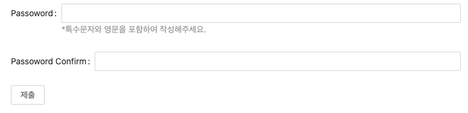

### DataEntry

- [API](####API)
- [API - Form.Item](###API-Form.Item)
- [API - Form.List](###API-Form.List)
- [API - operation](###API-operation)
- [Form.Provider](###Form.Provider)
- [FormInstance](###FormInstance)
- [Interface](###Interface)
- [FieldData](###FieldData)
- [Rule](###Rule)

#### Form

- form컴포넌트 안의 포함된 data를 관리하고 데이터를 수집, 확인, 스타일을 포함할 수 있습니다.
- 인스턴스를 만들거나 정보를 수집해야 하는 경우에 사용합니다.
- 특정 규칙의 필드를 검증해야 하는 경우에 사용합니다.

### API

- [Top](###DataEntry)
- [API - Form.Item](###API-Form.Item)
- [API - Form.List](###API-Form.List)
- [API - operation](###API-operation)
- [Form.Provider](###Form.Provider)
- [FormInstance](###FormInstance)
- [Interface](###Interface)
- [FieldData](###FieldData)
- [Rule](###Rule)

#### component

- form 렌더링 요소를 설정할 수 있습니다
- DOM 노드를 거짓으로 만들지 말아야 합니다.
- Type : ComponentType | false
- default : form

```js
import { Form } from 'antd';

ReactDOM.render(
  <Form component={'div'}>
    <Form.Item name="note" label="Note">
      <Input />
    </Form.Item>
    <Form.Item name="name" label="Name" rules={[{ required: true }]}>
      <Input />
    </Form.Item>
  </Form>,
  document.getElementById('container'),
);
```

#### colon

- Form.Item의 라벨옵션 뒤에 콜론(:)을 생성 유무를 설정할 수 있습니다.
- layout이 가로일때만 사용이 가능합니다.
- Type : boolean
- default : true

```js
import { Form } from 'antd';

ReactDOM.render(
  <Form colon={false}>
    <Form.Item name="note" label="Note">
      <Input />
    </Form.Item>
    <Form.Item name="name" label="Name" rules={[{ required: true }]}>
      <Input />
    </Form.Item>
  </Form>,
  document.getElementById('container'),
);
```

#### fields

- 폼의 필드 상태 관리를 조절할 수 있습니다.
- non-strong에는 권항하지 않습니다.
- storng
- Type : FieldData[]
- default : -

```js
import React, { useState } from 'react';
import { Form, Input } from 'antd';

const CustomizedForm = ({ onChange, fields }) => (
  <Form
    name="global_state"
    layout="inline"
    fields={fields}
    onFieldsChange={(changedFields, allFields) => {
      onChange(allFields);
    }}
  >
    <Form.Item
      name="username"
      label="Username"
      rules={[
        {
          required: true,
          message: 'Username is required!',
        },
      ]}
    >
      <Input />
    </Form.Item>
  </Form>
);

const Demo = () => {
  const [fields, setFields] = useState([
    {
      name: ['username'],
      value: 'Ant Design',
    },
  ]);
  return (
    <>
      <CustomizedForm
        fields={fields}
        onChange={(newFields) => {
          setFields(newFields);
        }}
      />
      <pre className="language-bash">{JSON.stringify(fields, null, 2)}</pre>
    </>
  );
};

ReactDOM.render(<Demo />, document.getElementById('container'));
```

#### form

- [FormInstance](###FormInstance)에 상세내용이 있습니다.

#### hideRequiredMark

- Form태그 내부의 Form.Item들의 required API의 마크(\*) 제거할 수 있습니다.
- Type : boolean
- default : false

```js
import { Form, Input } from 'antd';

ReactDOM.render(
  <Form hideRequiredMark>
    <Form.Item name="note" label="Note">
      <Input />
    </Form.Item>
    <Form.Item name="name" label="Name" rules={[{ required: true }]}>
      <Input />
    </Form.Item>
  </Form>,
  document.getElementById('container'),
);
```

#### initialValues

- Set value by Form initialization or reset
- Type : object
- default : -

```js
import { Form, Input } from 'antd';

ReactDOM.render(
  <Form initialValues={{ name: 'hello' }}>
    <Form.Item name="note" label="Note">
      <Input />
    </Form.Item>
    <Form.Item name="name" ="Name" rules={[{ required: true }]}>
      <Input />
    </Form.Item>
  </Form>,
  document.getElementById('container'),
);
```

#### labelAlign

- label의 위치를 설정할 수 있습니다.
- Form.Item내부의 영역에서 Input태그 사이의 영역에서만 이동이 진행됩니다.
- Type : left | right
- default : right

```js
import { Form, Input } from 'antd';
const layout = {
  labelCol: { span: 8 },
  wrapperCol: { span: 16 },
};
ReactDOM.render(
  <Form labelAlign="left" {...layout}>
    <Form.Item name="note" label="Note">
      <Input />
    </Form.Item>
    <Form.Item name="name" label="Name" rules={[{ required: true }]}>
      <Input />
    </Form.Item>
  </Form>,
  document.getElementById('container'),
);
```


#### labelCol

- label의 레이아웃을 [Col](../Layout/Grid.md###API-Col)컴포넌트처럼 정리할 수 있습니다.
- offset과 span을 설정하기 위해서 {span: 3, offset: 12} 또는 sm: {span: 3, offset: 12}을 이용할 수 있습니다.
- Type : object
- default : -

```js
import { Form, Input } from 'antd';

ReactDOM.render(
  <Form labelCol={{ span: 3, offset: 10 }}>
    <Form.Item name="note" label="Note">
      <Input />
    </Form.Item>
    <Form.Item name="name" label="Name" rules={[{ required: true }]}>
      <Input />
    </Form.Item>
  </Form>,
  document.getElementById('container'),
);
```

#### layout

- 폼의 레이아웃을 변경할 수 있습니다.
- Type : horizontal | vertical | inline
- default : horizontal

```js
import { Form, Input } from 'antd';

ReactDOM.render(
  <Form layout="inline">
    <Form.Item name="note" label="Note">
      <Input />
    </Form.Item>
    <Form.Item name="name" label="Name" rules={[{ required: true }]}>
      <Input />
    </Form.Item>
  </Form>,
  document.getElementById('container'),
);
```

#### name

- `Form`태그의 이름을 설정할 수 있습니다.
- 필드 id가 접두사가 됩니다.
- Type : string
- default : -

#### preserve

- 필드가 삭제 되었을때도 해당 값을 가지고 있을 수 있습니다.
- Type : boolean
- default : true
- version : 4.4.0

#### scrollToFirstError

- submit시 오류가 발생한 첫 필드로 이동됩니다.
- Type : boolean
- default : false

```js
ReactDOM.render(
  <Form scrollToFirstError>
    <Form.Item name="note" label="Note">
      <Input />
    </Form.Item>
    <Form.Item name="name" label="Name" rules={[{ required: true }]}>
      <Input />
    </Form.Item>
    <Form.Item>
      <Button htmlType="submit" style={{ height: '4000px' }}>
        제출
      </Button>
    </Form.Item>
  </Form>,
  document.getElementById('container'),
);
```

#### size

- 내부 컴포넌스 사이즈를 조절할 수 있습니다.
- antD컴포넌트만 적용이 됩니다.
- Type : small | middle | large
- default : -

```js
import { Form, Input, Button } from 'antd';

ReactDOM.render(
  <Form size="large">
    <Form.Item name="note" label="Note">
      <Input />
    </Form.Item>
    <Form.Item name="name" label="Name" rules={[{ required: true }]}>
      <Input />
    </Form.Item>
    <Form.Item>
      <Button htmlType="submit">제출</Button>
    </Form.Item>
  </Form>,
  document.getElementById('container'),
);
```

#### validateMessages

- 확인에서 문제가 발생하면 하단분에 발리데이트 메세지를 출력합니다.
- Type : validateMessage
- default : -

```js
import { Form, Input, Button } from 'antd';
const validateMessages = {
  required: 'You need write values',
};
ReactDOM.render(
  <Form size="large" validateMessages={validateMessages}>
    <Form.Item name="note" label="Note">
      <Input />
    </Form.Item>
    <Form.Item name="name" label="Name" rules={[{ required: true }]}>
      <Input />
    </Form.Item>
    <Form.Item>
      <Button htmlType="submit">제출</Button>
    </Form.Item>
  </Form>,
  document.getElementById('container'),
);
```

#### validateTrigger

- 제약조건을 설정할 수 있습니다.
- Type : string | string[]
- default : onChange
- version : 4.3.0

```js
import { Form, Input, Button } from 'antd';

ReactDOM.render(
  <Form size="large" validateTrigger={['onChange', 'onBlur']}>
    <Form.Item name="note" label="Note" rules={[{ required: true }]}>
      <Input />
    </Form.Item>
    <Form.Item name="name" label="Name">
      <Input />
    </Form.Item>
    <Form.Item>
      <Button htmlType="submit">제출</Button>
    </Form.Item>
  </Form>,
  document.getElementById('container'),
);
```

#### wrapperCol

- [labelCol](###labelCol)layout을 변경할 수 있습니다 .
- Type : object
- default : -

```js
import { Form, Input, Button } from 'antd';

ReactDOM.render(
  <Form size="large" wrapperCol={{ span: 4 }}>
    <Form.Item name="note" label="Note" rules={[{ required: true }]}>
      <Input />
    </Form.Item>
    <Form.Item name="name" label="Name">
      <Input />
    </Form.Item>
    <Form.Item>
      <Button htmlType="submit">제출</Button>
    </Form.Item>
  </Form>,
  document.getElementById('container'),
);
```

#### onFinish

- 폼의 과 확인 데이터를 성공적으로 제출되었을때 트리거를 짤 수 있습니다.
- function(values)
- default : -

```js
import { Form, Input, Button } from 'antd';

ReactDOM.render(
  <Form
    onFinish={(value) => {
      console.log(value);
    }}
  >
    <Form.Item name="note" label="Note" rules={[{ required: true }]}>
      <Input />
    </Form.Item>
    <Form.Item name="name" label="Name">
      <Input />
    </Form.Item>
    <Form.Item>
      <Button htmlType="submit">제출</Button>
    </Form.Item>
  </Form>,
  document.getElementById('container'),
);
```

#### onFinishFailed

- 폼의 과 확인 데이터를 제출실패했을때 트리거를 짤 수 있습니다.
- Type : function({ values, errorFields, outOfDate })
- default : -

```js
import { Form, Input, Button } from 'antd';

ReactDOM.render(
  <Form
    onFinishFailed={(value) => {
      console.log(value);
    }}
  >
    <Form.Item name="note" label="Note" rules={[{ required: true }]}>
      <Input />
    </Form.Item>
    <Form.Item name="name" label="Name">
      <Input />
    </Form.Item>
    <Form.Item>
      <Button htmlType="submit">제출</Button>
    </Form.Item>
  </Form>,
  document.getElementById('container'),
);
```


#### onFieldsChange

- 필드의 값이 변경되었을때 실행할 트리거를 짤 수 있습니다.
- Type : function(changedFields, allFields)
- default : -

```js
import { Form, Input, Button } from 'antd';

ReactDOM.render(
  <Form
    onFieldsChange={(value) => {
      console.log(value);
    }}
  >
    <Form.Item name="note" label="Note" rules={[{ required: true }]}>
      <Input />
    </Form.Item>
    <Form.Item name="name" label="Name">
      <Input />
    </Form.Item>
    <Form.Item>
      <Button htmlType="submit">제출</Button>
    </Form.Item>
  </Form>,
  document.getElementById('container'),
);
```

```
[Object]
0: Object
touched: true
validating: false
errors: Array[0]
name: Array[1]
0: "name"
value: "asd"
```

#### onValuesChange

- value 가 변경되었을때 실행할 트리거를 짤 수 있습니다.
- Type : function(changedValues, allValues)
- default : -

```js
import { Form, Input, Button } from 'antd';

ReactDOM.render(
  <Form
    onValuesChange={(value) => {
      console.log(value);
    }}
  >
    <Form.Item name="note" label="Note" rules={[{ required: true }]}>
      <Input />
    </Form.Item>
    <Form.Item name="name" label="Name">
      <Input />
    </Form.Item>
    <Form.Item>
      <Button htmlType="submit">제출</Button>
    </Form.Item>
  </Form>,
  document.getElementById('container'),
);
```

```
Object {note: "d"}
Object {note: "df"}
Object {note: "dfz"}
Object {name: "a"}
```

---

### API-Form.Item

- [Top](###DataEntry)
- [API](####API)
- [API - Form.Item](###API-Form.Item)
- [API - Form.List](###API-Form.List)
- [API - operation](###API-operation)
- [Form.Provider](###Form.Provider)
- [FormInstance](###FormInstance)
- [Interface](###Interface)
- [FieldData](###FieldData)
- [Rule](###Rule)

#### colon

- label뒤에 콜론(:)을 추가시켜 줍니다.
- Type : boolean
- default : true

```js
import { Form, Input, Button } from 'antd';

ReactDOM.render(
  <Form>
    <Form.Item name="note" label="Note" colon={false}>
      <Input />
    </Form.Item>
    <Form.Item name="name" label="Name" colon={true}>
      <Input />
    </Form.Item>
    <Form.Item>
      <Button htmlType="submit">제출</Button>
    </Form.Item>
  </Form>,
  document.getElementById('container'),
);
```

#### dependencies

- 필드의 의존성을 추가합니다.
- 필드 사이에 종속성이 있을때 사용합니다.
- Type : NamePath[]
- default : -

#### extra

- 입력하기전에 메세지를 추가할 수 있습니다.
- 에러 메세지와 프롬포트 메세지를 동시에 띄우고 싶을때 사용합니다.
- Type : string | ReactNode
- default : -

```js
import { Form, Input, Button } from 'antd';

ReactDOM.render(
  <Form>
    <Form.Item
      name="passoword"
      label="Passoword"
      extra={'*특수문자와 영문을 포함하여 작성해주세요.'}
    >
      <Input />
    </Form.Item>
    <Form.Item name="confirm" label="Passoword Confirm">
      <Input />
    </Form.Item>
    <Form.Item>
      <Button htmlType="submit">제출</Button>
    </Form.Item>
  </Form>,
  document.getElementById('container'),
);
```

;

#### getValueFromEvent

- 이벤트나, 다른 onChange로부터 값을 어떤식으로 받을지 지정합니다.
- Type : (..args: any[]) => any
- default : -

#### getValueProps Additional props with sub component (value: any) => any - 4.2.0

#### hasFeedback Used with validateStatus, this option specifies the validation status icon. Recommended to be used only with Input boolean false

#### help The prompt message. If not provided, the prompt message will be generated by the validation rule. string | ReactNode -

#### htmlFor Set sub label htmlFor string -

#### initialValue Config sub default value. Form initialValues get higher priority when conflict string - 4.2.0

#### noStyle No style for true, used as a pure field control boolean false

#### label Label text string | ReactNode -

#### labelAlign The text align of label left | right right

#### labelCol The layout of label. You can set span offset to something like {span: 3, offset: 12} or sm: {span: 3, offset: 12} same as with <Col>. You can set labelCol on Form. If both exists, use Item first object -

#### name Field name, support array NamePath -

#### normalize Normalize value from component value before passing to Form instance (value, prevValue, prevValues) => any -

#### preserve Keep field value even when field removed boolean true 4.4.0

#### required Display required style. It will be generated by the validation rule boolean false

#### rules Rules for field validation. Click here to see an example Rule[] -

#### shouldUpdate Custom field update logic. See below boolean | (prevValue, curValue) => boolean false

#### trigger When to collect the value of children node string onChange

#### validateFirst Whether stop validate on first rule of error for this field. Will parallel validate when parallel cofigured boolean | parallel false parallel: 4.5.0

#### validateStatus The validation status. If not provided, it will be generated by validation rule. options: success warning error validating string -

#### validateTrigger When to validate the value of children node string | string[] onChange

#### valuePropName Props of children node, for example, the prop of Switch is 'checked'. This prop is an encapsulation of getValueProps, which will be invalid after customizing getValueProps string value

#### wrapperCol The layout for input controls, same as labelCol. You can set wrapperCol on Form. If both exists, use Item first object -

#### hidden Whether to hide Form.Item (still collect and validate value) boolean false

---

### API-Form.List

- [Top](###DataEntry)
- [API](####API)
- [API - Form.Item](###API-Form.Item)
- [API - operation](###API-operation)
- [Form.Provider](###Form.Provider)
- [FormInstance](###FormInstance)
- [Interface](###Interface)
- [FieldData](###FieldData)
- [Rule](###Rule)

---

### API-operation

- [Top](###DataEntry)
- [API](####API)
- [API - Form.Item](###API-Form.Item)
- [API - Form.List](###API-Form.List)
- [Form.Provider](###Form.Provider)
- [FormInstance](###FormInstance)
- [Interface](###Interface)
- [FieldData](###FieldData)
- [Rule](###Rule)

---

### Form.Provider

- [Top](###DataEntry)
- [API](####API)
- [API - Form.Item](###API-Form.Item)
- [API - Form.List](###API-Form.List)
- [API - operation](###API-operation)
- [FormInstance](###FormInstance)
- [Interface](###Interface)
- [FieldData](###FieldData)
- [Rule](###Rule)

---

### FormInstance

- [Top](###DataEntry)
- [API](####API)
- [API - Form.Item](###API-Form.Item)
- [API - Form.List](###API-Form.List)
- [API - operation](###API-operation)
- [Form.Provider](###Form.Provider)
- [Interface](###Interface)
- [FieldData](###FieldData)
- [Rule](###Rule)

```js
import { Form, Input, Button, Select } from 'antd';

const { Option } = Select;

const layout = {
  labelCol: { span: 8 },
  wrapperCol: { span: 16 },
};
const tailLayout = {
  wrapperCol: { offset: 8, span: 16 },
};

const Demo = () => {
  const [form] = Form.useForm();

  const onGenderChange = (value) => {
    switch (value) {
      case 'male':
        form.setFieldsValue({
          note: 'Hi, man!',
        });
        return;

      case 'female':
        form.setFieldsValue({
          note: 'Hi, lady!',
        });
        return;

      case 'other':
        form.setFieldsValue({
          note: 'Hi there!',
        });
        return;

      default:
        form.setFieldsValue({
          note: null,
        });
    }
  };

  const onFinish = (values) => {
    console.log(values);
  };

  const onReset = () => {
    form.resetFields();
  };

  const onFill = () => {
    form.setFieldsValue({
      note: 'Hello world!',
      gender: 'male',
    });
  };

  return (
    <Form {...layout} form={form} name="control-hooks" onFinish={onFinish}>
      <Form.Item name="note" label="Note" rules={[{ required: true }]}>
        <Input />
      </Form.Item>
      <Form.Item name="gender" label="Gender" rules={[{ required: true }]}>
        <Select
          placeholder="Select a option and change input text above"
          onChange={onGenderChange}
          allowClear
        >
          <Option value="male">male</Option>
          <Option value="female">female</Option>
          <Option value="other">other</Option>
        </Select>
      </Form.Item>
      <Form.Item
        noStyle
        shouldUpdate={(prevValues, currentValues) =>
          prevValues.gender !== currentValues.gender
        }
      >
        {({ getFieldValue }) => {
          return getFieldValue('gender') === 'other' ? (
            <Form.Item
              name="customizeGender"
              label="Customize Gender"
              rules={[{ required: true }]}
            >
              <Input />
            </Form.Item>
          ) : null;
        }}
      </Form.Item>
      <Form.Item {...tailLayout}>
        <Button type="primary" htmlType="submit">
          Submit
        </Button>
        <Button htmlType="button" onClick={onReset}>
          Reset
        </Button>
        <Button type="link" htmlType="button" onClick={onFill}>
          Fill form
        </Button>
      </Form.Item>
    </Form>
  );
};

ReactDOM.render(<Demo />, mountNode);
```

#### form

- `Form`을 조종할때 Form.useForm()을 인스턴스로 생성합니다.
- 제공하지 않아도 자동으로 생성됩니다.
- Type : FormInstance
- default : -

#### getFieldInstance

- 필드 인스턴스값을 가져옵니다.
- Type : (name: NamePath) => any
- version : 4.4.0

#### getFieldValue

- 필드 내부에 고정된 값을 받아올 수 있습니다.
- name을 작성하지 않으면 undefined를 제외하고 모두 받아올 수 있습니다.
- String형태로 입력합니다.
- Type : (name: NamePath) => any

```js
const Instans = () => {
  const [form] = Form.useForm();

  const getFieldValue = () => {
    console.log(form.getFieldValue('name'));
  };

  return (
    <Form form={form}>
      <Form.Item name="note" label="Note">
        <Input />
      </Form.Item>
      <Form.Item name="name" label="Name">
        <Input />
      </Form.Item>
      <Form.Item name="age" label="Age">
        <Input />
      </Form.Item>
      <Form.Item>
        <Button htmlType="submit" onClick={getFieldValue}>
          submit
        </Button>
      </Form.Item>
    </Form>
  );
};
ReactDOM.render(<Instans />, document.getElementById('container'));
```

#### getFieldsValue

- 필드 내부에 고정된 값들을 받아올 수 있습니다.
- nameList를 작성하지 않으면 모든 값들을 받아옵니다.
- Arrray형태로 입력합니다.
- Type : (nameList?: NamePath[], filterFunc?: (meta: { touched: boolean, validating: boolean }) => boolean) => any

```js
import { Form, Input, Button } from 'antd';

const Instans = () => {
  const [form] = Form.useForm();

  const getFieldsValue = () => {
    console.log(form.getFieldsValue(['note', 'name']));
  };

  return (
    <Form form={form}>
      <Form.Item name="note" label="Note">
        <Input />
      </Form.Item>
      <Form.Item name="name" label="Name">
        <Input />
      </Form.Item>
      <Form.Item name="age" label="Age">
        <Input />
      </Form.Item>
      <Form.Item>
        <Button htmlType="submit" onClick={getFieldsValue}>
          submit
        </Button>
      </Form.Item>
    </Form>
  );
};
ReactDOM.render(<Instans />, document.getElementById('container'));
```

#### getFieldError

- name에 입력되어진 필드에서 띄워진 에러 메시지를 받아올 수 있습니다.
- String 형태로 입력합니다.
- Type : (name: NamePath) => string[]

```js
import { Form, Input, Button } from 'antd';

const Instans = () => {
  const [form] = Form.useForm();
  const usernameError = () => {
    console.log(form.getFieldError('name'));
  };

  return (
    <>
      <Form form={form}>
        <Form.Item name="note" label="Note">
          <Input />
        </Form.Item>
        <Form.Item name="name" label="Name" rules={[{ required: true }]}>
          <Input />
        </Form.Item>
        <Form.Item>
          <Button htmlType="submit" onClick={usernameError}>
            submit
          </Button>
        </Form.Item>
      </Form>
    </>
  );
};
ReactDOM.render(<Instans />, document.getElementById('container'));
```

#### getFieldsError

- nameList에 입력되어진 필드에서 띄워진 에러 메시지를 받아올 수 있습니다.
- Arrray형태로 입력합니다.
- Type : (nameList?: NamePath[]) => FieldError[]

```js
import { Form, Input, Button } from 'antd';

const Instans = () => {
  const [form] = Form.useForm();
  const usernameError = () => {
    console.log(form.getFieldsError('name', 'note'));
  };

  return (
    <>
      <Form form={form}>
        <Form.Item name="note" label="Note" rules={[{ required: true }]}>
          <Input />
        </Form.Item>
        <Form.Item name="name" label="Name" rules={[{ required: true }]}>
          <Input />
        </Form.Item>
        <Form.Item>
          <Button htmlType="submit" onClick={usernameError}>
            submit
          </Button>
        </Form.Item>
      </Form>
    </>
  );
};
ReactDOM.render(<Instans />, document.getElementById('container'));
```

#### isFieldTouched

- 필드가 작동 되었는지 확인할 수 있습니다.
- Type : (name: NamePath) => boolean

```js
import { Form, Input, Button } from 'antd';

const Instans = () => {
  const [form] = Form.useForm();

  const onValuesChange = () => {
    console.log(form.isFieldTouched('name'));
  };

  return (
    <Form form={form}>
      <Form.Item name="note" label="Note">
        <Input />
      </Form.Item>
      <Form.Item name="name" label="Name" rules={[{ required: true }]}>
        <Input />
      </Form.Item>
      <Form.Item name="age" label="Age">
        <Input />
      </Form.Item>
      <Form.Item>
        <Button htmlType="submit" onClick={onValuesChange}>
          submit
        </Button>
      </Form.Item>
    </Form>
  );
};
ReactDOM.render(<Instans />, document.getElementById('container'));
```

#### isFieldsTouched

- 필드가 작동 되었는지 확인할 수 있습니다.
- 모든 필드가 작동 되었는지 확인하기 위해 사용할 수 있습니다.
- Type : (nameList?: NamePath[], allTouched?: boolean) => boolean

```js
import { Form, Input, Button } from 'antd';

const Instans = () => {
  const [form] = Form.useForm();

  const onValuesChange = () => {
    console.log(form.isFieldsTouched());
  };

  return (
    <Form form={form}>
      <Form.Item name="note" label="Note">
        <Input />
      </Form.Item>
      <Form.Item name="name" label="Name" rules={[{ required: true }]}>
        <Input />
      </Form.Item>
      <Form.Item name="age" label="Age">
        <Input />
      </Form.Item>
      <Form.Item>
        <Button htmlType="submit" onClick={onValuesChange}>
          submit
        </Button>
      </Form.Item>
    </Form>
  );
};
ReactDOM.render(<Instans />, document.getElementById('container'));
```

#### isFieldValidating

- 필드의 validating을 확인할 수 있습니다.
- Type : (name: NamePath) => boolean

```js
const Instans = () => {
  const [form] = Form.useForm();
  const onValuesChange = () => {
    console.log(form.isFieldValidating());
  };

  return (
    <Form form={form}>
      <Form.Item name="note" label="note">
        <Input />
      </Form.Item>
      <Form.Item name="name" label="Name" rules={[{ required: true }]}>
        <Input />
      </Form.Item>
      <Form.Item name="age" label="Age">
        <Input />
      </Form.Item>
      <Form.Item>
        <Button htmlType="submit" onClick={onValuesChange}>
          submit
        </Button>
      </Form.Item>
    </Form>
  );
};
ReactDOM.render(<Instans />, document.getElementById('container'));
```

#### resetFields

- 필드를 리셋 해줍니다.
- nameList를 작성하지 않으면 모든 필드를 초기화 합니다.
- Array형태로 입력합니다.
- Type : (fields?: NamePath[]) => void

```js
import { Form, Input, Button } from 'antd';

const Instans = () => {
  const [form] = Form.useForm();
  const resetField = () => {
    form.resetFields();
  };
  return (
    <Form form={form}>
      <Form.Item name="note" label="note">
        <Input />
      </Form.Item>
      <Form.Item name="name" label="Name" rules={[{ required: true }]}>
        <Input />
      </Form.Item>
      <Form.Item name="age" label="Age">
        <Input />
      </Form.Item>
      <Form.Item>
        <Button onClick={resetField}>reset</Button>
      </Form.Item>
    </Form>
  );
};
ReactDOM.render(<Instans />, document.getElementById('container'));
```

#### scrollToField

- 필드의 위치로 이동합니다.
- Type : (name: NamePath, options: [ScrollOptions]) => void

```js
import { Form, Input, Button } from 'antd';

const Instans = () => {
  const [form] = Form.useForm();
  const scrollToField = () => {
    form.scrollToField('name', true);
  };
  return (
    <Form form={form}>
      <Form.Item name="note" label="note">
        <Input />
      </Form.Item>
      <Form.Item name="name" label="Name" rules={[{ required: true }]}>
        <Input />
      </Form.Item>
      <Form.Item name="age" label="Age">
        <Input />
      </Form.Item>
      <Form.Item>
        <Button onClick={scrollToField}>reset</Button>
      </Form.Item>
    </Form>
  );
};
ReactDOM.render(<Instans />, document.getElementById('container'));
```

#### setFields

- 필드 상태를 설정할 수 있습니다. Set fields status
- Type : (fields: FieldData[]) => void

#### setFieldsValue Set fields value (values) => void

```js
import { Form, Input, Button } from 'antd';

const Instans = () => {
  const [form] = Form.useForm();
  const setFields = () => {
    form.setFieldsValue({
      name: 'hello world!',
      note: 'this is note',
    });
  };
  return (
    <Form form={form}>
      <Form.Item name="note" label="note">
        <Input />
      </Form.Item>
      <Form.Item name="name" label="Name" rules={[{ required: true }]}>
        <Input />
      </Form.Item>
      <Form.Item name="age" label="Age">
        <Input />
      </Form.Item>
      <Form.Item>
        <Button onClick={setFields}>reset</Button>
      </Form.Item>
    </Form>
  );
};
ReactDOM.render(<Instans />, document.getElementById('container'));
```

#### submit

- form을 제출합니다. submit버튼 과 동일합니다.
- Type : sbutton () => void

#### validateFields

- 필드 값의 유효성을 검사합니다.
- (nameList?: NamePath[]) => Promise

---

### Interface

- [Top](###DataEntry)
- [API](####API)
- [API - Form.Item](###API-Form.Item)
- [API - Form.List](###API-Form.List)
- [API - operation](###API-operation)
- [Form.Provider](###Form.Provider)
- [FormInstance](###FormInstance)
- [FieldData](###FieldData)
- [Rule](###Rule)

#### FieldData

- [Top](###DataEntry)
- [API](####API)
- [API - Form.Item](###API-Form.Item)
- [API - Form.List](###API-Form.List)
- [API - operation](###API-operation)
- [Form.Provider](###Form.Provider)
- [FormInstance](###FormInstance)
- [Interface](###Interface)
- [Rule](###Rule)

#### Rule

- [Top](###DataEntry)
- [API](####API)
- [API - Form.Item](###API-Form.Item)
- [API - Form.List](###API-Form.List)
- [API - operation](###API-operation)
- [Form.Provider](###Form.Provider)
- [FormInstance](###FormInstance)
- [Interface](###Interface)
- [FieldData](###FieldData)
