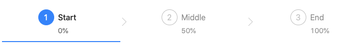

### Navigation

- [API-Steps](###API-Steps)
- [API-Steps.Step](###API-Steps.Step)

#### Steps

- 스텝은 현재 진행중인 과제의 단계를 표현할 수 있습니다.
- 작업의 세부작업을 표현할 수 있고, 각각의 단계를 보기 쉽게 표현해줄 수 있습니다.

---

### API-Steps

- [Top](###Navigation)
- [API-Steps.Step](###API-Steps.Step)

#### className

- Step에 클래스 명을 지정해줄 수 있습니다.
- Type : string
- default : -

```js
import { Steps } from 'antd';

const { Step } = Steps;

ReactDOM.render(
  <Steps className="stepClassName">
    <Step title="Start" description="0%" />
    <Step title="Middle" description="50%" />
    <Step title="End" description="100%" />
  </Steps>,
  document.getElementById('container'),
);
```

#### type

- 스텝의 타입을 설정할 수 있습니다.
- default,navigation의 값을 사용할 수 있습니다.
- Type : string
- default : default

```js
import { Steps } from 'antd';

const { Step } = Steps;

ReactDOM.render(
  <Steps type="navigation">
    <Step title="Start" description="0%" />
    <Step title="Middle" description="50%" />
    <Step title="End" description="100%" />
  </Steps>,
  document.getElementById('container'),
);
```



```js
import { Steps } from 'antd';

const { Step } = Steps;

ReactDOM.render(
  <Steps type="default">
    <Step title="Start" description="0%" />
    <Step title="Middle" description="50%" />
    <Step title="End" description="100%" />
  </Steps>,
  document.getElementById('container'),
);
```


#### current

- 현재 스텝을 설정할 수 있습니다.
- 0에서 부터 시작합니다.
- status,step으로 재작성할 수 있습니다.
- Type : number
- default : 0

```js
import { Steps } from 'antd';

const { Step } = Steps;

ReactDOM.render(
  <Steps current={1}>
    <Step title="Start" description="0%" />
    //완료
    <Step title="Middle" description="50%" />
    //해당지역에 위치합니다.
    <Step title="End" description="100%" />
  </Steps>,
  document.getElementById('container'),
);
```

#### direction

- step bar의 방향을 정할 수 있습니다.
- Type : string(horizontal | vertical)
- default : horizontal

```js
import { Steps } from 'antd';

const { Step } = Steps;

ReactDOM.render(
  <Steps direction={'vertical'}>
    <Step title="Start" description="0%" />
    <Step title="Middle" description="50%" />
    <Step title="End" description="100%" />
  </Steps>,
  document.getElementById('container'),
);
```

#### labelPlacement

- 설명부분의 위치를 title을 기준으로 아래에둘지 옆에 둘지를 선택할 수 있습니다.
- Type : string(horizontal | vertical)
- default : horizontal

```js
import { Steps } from 'antd';

const { Step } = Steps;

ReactDOM.render(
  <Steps direction={'vertical'}>
    <Step title="Start" description="0%" />
    <Step title="Middle" description="50%" />
    <Step title="End" description="100%" />
  </Steps>,
  document.getElementById('container'),
);
```

#### progressDot

- 스텝의 프로그레스 점을 스타일 할 수 있습니다.
- function을 이용하여 값을 변경할 수 있습니다.
- lavelPlacement는 자동적으로 vertical로 적용이 됩니다.
- Type : boolean | (iconDot, {index, status, title, description}) => ReactNode
- default : false

```js
import { Steps } from 'antd';

const { Step } = Steps;

ReactDOM.render(
  <Steps progressDot>
    <Step title="Start" description="0%" />
    <Step title="Middle" description="50%" />
    <Step title="End" description="100%" />
  </Steps>,
  document.getElementById('container'),
);
```

#### size

- 스텝바의 크기를 지정할 수 있습니다.
- Type : string(default|small)
- default : default

```js
import { Steps } from 'antd';

const { Step } = Steps;

ReactDOM.render(
  <Steps size="small">
    <Step title="Start" description="0%" />
    <Step title="Middle" description="50%" />
    <Step title="End" description="100%" />
  </Steps>,
  document.getElementById('container'),
);
```

#### status

- 현재 진행중인 상태에서 상태를 표시할 수 있습니다.
- Type : string(wait,process,finish,error)
- default : process

```js
import { Steps } from 'antd';

const { Step } = Steps;

ReactDOM.render(
  <Steps status="error" current={2}>
    <Step title="Start" description="0%" />
    //finish
    <Step title="Middle" description="50%" />
    //finish
    <Step title="End" description="100%" />
    //error
  </Steps>,
  document.getElementById('container'),
);
```

#### inital

- 스텝을 시작점을 설정할 수 있습니다.
- status : 적용되지 않습니다.
- current : 2부터 0으로 취급해서 시작됩니다.
- Type : number
- default : 0

```js
import { Steps } from 'antd';

const { Step } = Steps;

ReactDOM.render(
  <Steps status="error" initail={2}>
    <Step title="Start" description="0%" />
    //3 status적용이 안됌
    <Step title="Middle" description="50%" />
    //4
    <Step title="End" description="100%" />
    //5
  </Steps>,
  document.getElementById('container'),
);
```

#### onChange

- 스텝의 변환을 설정할 수 있습니다.
- Type : (current) => void
- default : -

```js
import { Steps } from 'antd';

const { Step } = Steps;
class StepMoved extends React.Component {
  state = {
    current: 0,
  };

  onChange = (current) => {
    this.setState({ current });
  };

  render() {
    const { current } = this.state;
    return (
      <>
        <Steps current={current} onChange={this.onChange}>
          <Step title="Start" description="0%" />
          <Step title="Middle" description="50%" />
          <Step title="End" description="100%" />
        </Steps>
      </>
    );
  }
}
ReactDOM.render(<StepMoved />, document.getElementById('container'));
```

#### percent

- 스텝의 내부 동그라미에 현재 진행 상황을 퍼센트로 수치화 할 수 있습니다.
- 원 외부에 테두리로 현재 진행 사항을 알 수 있습니다.
- Type :number
- default : -
- version : 4.5.0

```js
import { Steps } from 'antd';

const { Step } = Steps;

ReactDOM.render(
  <Steps percent="10">
    <Step title="Start" description="0%" />
    <Step title="Middle" description="50%" />
    <Step title="End" description="100%" />
  </Steps>,
  document.getElementById('container'),
);
```

---

### API-Steps.Step

- [Top](###Navigation)
- [API-Steps](###API-Steps)

#### description

- step과 속성값을 설명할 수 있습니다.
- Type : string|ReactNode
- default : -

```js
import { Steps } from 'antd';

const { Step } = Steps;

ReactDOM.render(
  <>
    <Steps>
      <Step title="Start" description="This is Current Step Start." />
      <Step title="Progress" description="This is Current Step Progress." />
      <Step title="Finish" description="This is Current Step Finish." />
    </Steps>
  </>,
  document.getElementById('container'),
);
```

#### icon

- Icon으로 스텝을 표시할 수 있습니다.
- Type : string|ReactNode
- default : -

```js
import { Steps } from 'antd';
import { AppleOutlined } from '@ant-design/icons';

const { Step } = Steps;

ReactDOM.render(
  <>
    <Steps>
      <Step title="Start" icon={<AppleOutlined />} />
      <Step title="Progress" description="This is Current Step Progress." />
      <Step title="Finish" description="This is Current Step Finish." />
    </Steps>
  </>,
  document.getElementById('container'),
);
```

#### status

- 현제 스테이터스 값을 표시할 수 있습니다.
- Steps의 current값과 자동적으로 같아집니다.
- Type : string(wait|process|finish|error)
- default : wait

```js
import { Steps } from 'antd';

const { Step } = Steps;

ReactDOM.render(
  <>
    <Steps>
      <Step
        title="Start"
        description="This is Current Step Start."
        status="process"
      />
      <Step
        title="Progress"
        description="This is Current Step Progress."
        status="finish"
      />
      <Step title="Finish" description="This is Current Step Finish." />
    </Steps>
  </>,
  document.getElementById('container'),
);
```

#### Title

- 스텝의 서브타이틀을 지정할 수 있습니다.
- Type : string|ReactNode
- default : -

```js
import { Steps } from 'antd';

const { Step } = Steps;

ReactDOM.render(
  <>
    <Steps>
      <Step title="Start" />
      <Step title="Progress" />
      <Step title="Finish" />
    </Steps>
  </>,
  document.getElementById('container'),
);
```

#### subTitle

- 스텝의 서브타이틀을 지정할 수 있습니다.
- Type : string|ReactNode
- default : -

```js
import { Steps } from 'antd';

const { Step } = Steps;

ReactDOM.render(
  <>
    <Steps>
      <Step title="Start" subTitle="0%" />
      <Step title="Progress" subTitle="50%" />
      <Step title="Finish" subTitle="100%" />
    </Steps>
  </>,
  document.getElementById('container'),
);
```

#### disabled

- 클릭을 불가능하게 만듭니다.
- Type : boolean
- default : false

```js
import { Steps } from 'antd';

const { Step } = Steps;

ReactDOM.render(
  <>
    <Steps>
      <Step title="Start" subTitle="0%" />
      <Step title="Progress" subTitle="50%" disabled />
      <Step title="Finish" subTitle="100%" />
    </Steps>
  </>,
  document.getElementById('container'),
);
```
