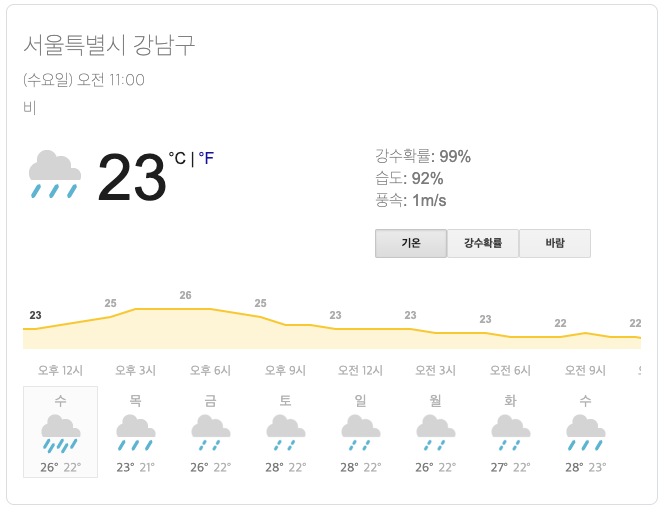

# Korea Weather Web

## 설계 단계

### 크롤링할 날씨 정보 사이트

구글에서 지원하는 날씨 정보이다.
[구글날씨](https://www.google.com/search?q=weather)

### package.json
```json
{
    "name" : "korea-weather-web", // 프로젝트 이름 (필수항목)
    "version": "1.0.0", // 현재 프로젝트의 버전 (필수항목) [누락시 패키지를 설치할 수 없다.]
    "private" : true,  // true로 설정하면 publish 명령을 거부한다.
    "description": "TestProject #1 - Korea Weather Web", // 프로젝트 설명
    "scripts": { // 패키지의 script 명령 key는 이벤트이고 값은 실행될 커맨드이다.
        "build": "yarn lint;babel ./src -d ./build", // build 명령어를 통해 eslint를 거쳐 babel에서 트랜스 파일링 한다.
        "start": "yarn build;node ./build/index.js", // start 명령어를 통해 index.js 파일을 빌드한다.
        "dev": "nodemon --exec 'eslint src --color && babel-node ./src'", // dev 명령어를 통해 nodemon 패키지를 실행하고 eslint를 실행하면서 color를 활성화 하고 src 폴더의 js 파일을 bable을 거쳐 테스트한다.
        "lint": "eslint src --color", // eslint를 실행하고 color를 활성화 한다.
        "test": "mocha" // test 명령어를 통해 mocha를 실행한다.
    },
    "dependencies": { // 의존성을 규정
        "@babel/polyfill": "^7.10.4" // ES6 환경을 제공해준다.
    },
    "husky": { // git hook을 손쉽게 제어하도록 도와주는 매니저이다.
        "hooks": { // 커스터마이징할 내용을 담는다.
          "pre-commit": "yarn lint", // 커밋 할때 동시에 yarn lint 명령어를 실행한다.
          "pre-push": "yarn test" // push 할때 동시에 yarn test 명령어를 실행한다.
        }
    },
    "devDependencies": { // 프로젝트와 연관된 모듈의 목록
    // {자세한 내용은 아래 정리}
    },
    "engines": { // 실행 기반을 지정할 수 있다.
        "node": ">= 10.15.0" // node 버전이 10.15.0 보다 크거나 같아야한다.
    }
}
```

#### Babel
ES6 이상의 자바스크립트 코드 파일을 구버전의 브라우저에서도 구동할 수 있게 ES5 이하의 문법으로 트랜스파일링 해주는 도구이다.

```json
// 버전의 "^version" 표시는 해당 버전과 호환되는 모듈을 뜻한다.
"@babel/cli": "^7.10.5", // Commandline을 통해 bable을 실행할 수 있는 바이너리 파일이 들어있다.
"@babel/core": "^7.10.5", // transform과 관련한 기능을 제공한다.
"@babel/node": "^7.10.5", // node.js에서 Babel을 활용할 수 있다.
"@babel/preset-env": "^7.10.4", // 함께 사용되어야 하는 Babel 플러그인이 내장되어있다.
"babel-eslint": "^10.1.0", // eslint 구문 분석을 위한 babel의 파서
"babel-plugin-module-resolver": "^4.0.0", // import path를 간단하게 만들어주는 바벨 라이브러리
//ex import test from 'src/index.js'
//미사용시 import test from '../../../../src/index.js'
```

#### .babelrc
Babel을 사용하기 위한 설정이 들어있는 파일이다.
설치한 프리셋을 연결해줄 수 있다.

```js
{
  "presets": ["@babel/preset-env"], // babel/preset-env 를 사용한다.
  "plugins": [ // 플러그인
    [
      "module-resolver", // ./src 경로의 별명을 root로 지정한다.
      {
        "root": ["./src"]
      }
    ]
  ]
}
```


#### eslint
자바스크립트 코드의 문법에 에러를 표시해주거나 코딩스타일을 룰을 통해 지정할 수 있다.
협업시 코딩스타일을 통일시켜준다.

```json
"eslint": "^7.5.0", // eslint 모듈의 base이다.
"eslint-config-airbnb-base": "^14.2.0", // airbnb 사의 코딩 스타일을 적용한다.
"eslint-plugin-import": "^2.22.0", // plugin을 import 시켜주는 역할로 airbnb-base를 사용하기 위한 플러그인이다.
```

#### .eslintrc
eslint 에서 사용하기 위한 정해진 rule 혹은 자신만의 rule을 적용할 수 있는 파일이다.
rule은 json 형식으로 설정할 수 있다.

```js
{
  "env": { // 프로젝트의 사용 환경 (browser, node, mocha 등)
    "browser": true,
    "es2020": true,
  },
  "extends": [ // 확장 설정
    "airbnb-base" // airbnb-base를 사용한다.
  ],
  "parser": "babel-eslint", // 
  "parserOptions": { // 자바스크립트 버전, 모듈 사용 여부 등을 설정할 수 있다.
    "ecmaVersion": 11,
    "sourceType": "module"
  },
  "rules": { // extends와 plugins에 대한 세부 설정을 변경하는 코드를 넣는다.
    "no-console": 0
  }
}
```

#### nodemon
node가 실행하는 파일이 속한 디렉토리를 감시하고 있다가 파일이 수정되면 자동으로 노트 애플리케이션을 재시작하는 확장 모듈이다.

```json
"nodemon": "^2.0.4"
```

#### .gitignore
Project에 원하지 않는 Backup File이나 Log File, 혹은 컴파일 된 파일들을 Git에서 제외시킬 수 있는 설정 File이다.

### 크롤링 과정과 데이터 변환 과정

#### 크롤링?
__크롤링__ 은 원하는 페이지를 탐색하고 다른 페이지로 옮겨다니는 것
__스크랩핑__ 은 도달한 페이지의 내용을 가져와서 원하는 형태로 가공하는 것

#### 대상 날씨 정보 사이트


크롬 개발자 도구를 통해서 가져올 데이터의 HTML 태그 이름과 `id` 혹은 `class` 이름을 확인한다.

#### 현재 날씨 정보 태그
날씨 `div` 태그 class명 : vk_c card-section
현재 위치 `div` 태그 class 명 : vk_gy vk_h
업데이트 일시 `div` 태그 class 명 : vk_gy vk_sh
현재 날씨 `div` 태그 class 명 : wob_dcp
현재 날씨 `img` 태그 id 명 : wob_tci
현재 온도 `span` 태그 class 명 : wob_t
강수확률 `div` 태그 : `span` wob_pp
습도 `div` 태그 : `span` wob_hm
풍속 `div` 태그 : `span` wob_t

날씨의 Div 태그의 DOM 위치는 아래와 같다.
```js
body > div > div > div > div > div > div > div > div > div > div > div > div
```

아래의 `id`를 통해 바로 접근이 가능하며
`document.querySelector`를 이용하여 변수에 담아 `bodylist` 를 기준으로 데이터를 찾는다.
```js
// const bodylist
#wob_wc
```

데이터를 가져오기 위해 아래 클래스, 태그명으로 접근을 하여,
해당 데이터 값을 JSON 객체로 저장해준다.
```js
//let newObj
title : #wob_loc(현재위치)
updating : #wob_dts(업데이트일시)
weather : #wob_dc(현재날씨)
temp : #wob_tm(현재온도)
precipitation : #wob_pp(강수확률)
humidity : #wob_hm(습도)
windSpeed : #wob_hm(풍속)
```

크롤링을 통해 받아온 데이터를 변환하여 JSON 객체로 만든 모습의 예시는 아래와 같다.
```js
//let newObj
[
    {
        title : "서울특별시 강남구",
        updating : "(수요일) 오전 11:00"
        weather : "비",
        temp : "23",
        precipitation : "99%",
        humidity : "92%",
        windSpeed : "1m/s",
    }
]
```

만들어진 JSON을 Node.js의 `response.send(newObj)`를 통해 자바스크립트로 반환한다.
Javascript에서는 받아온 JSON을 토대로 해당 위치에 맞게 데이터를 나누어 HTML 템플릿에 넣어준다.

### 화면 구성


초기 디자인의 모습이다.

전체를 감싼 div 태그를 가운데 배치시킨다.
`상단` : 현재 위치를 표시한다. [title]
`중앙` : 온도와 아래 작게 체감온도를 표시한다. [temp, bodilyTemp]
`하단` : 습도, 풍량, 강수확률을 넣고 JSON의 정보를 볼 수 있는 버튼을 넣는다. [humidity, windSpeed, precipitation]

