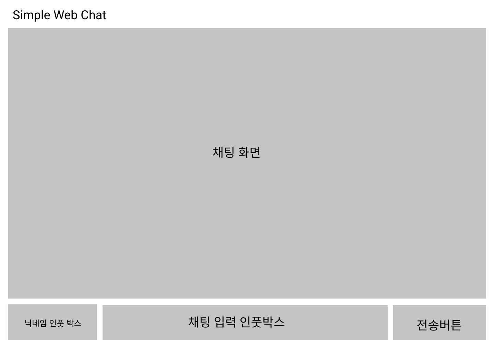
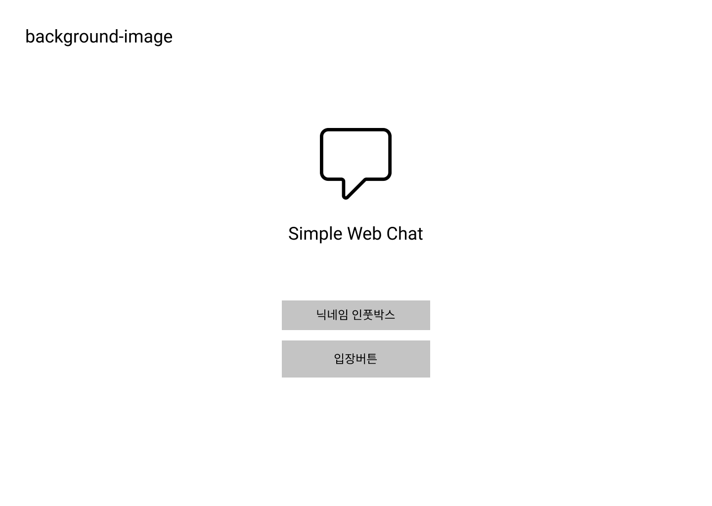
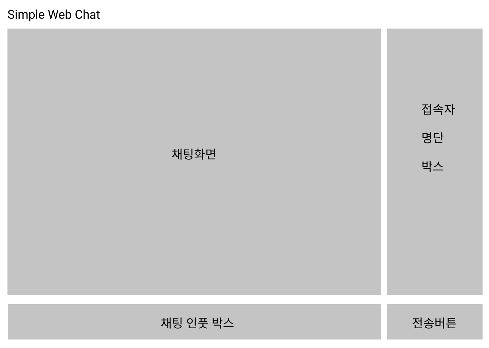
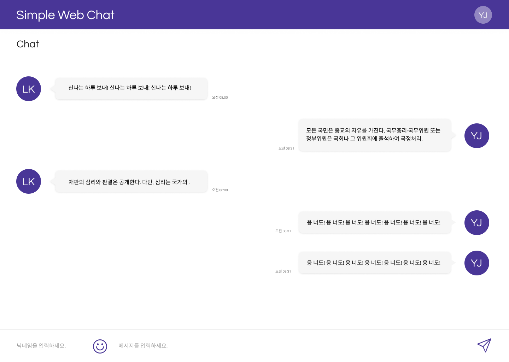
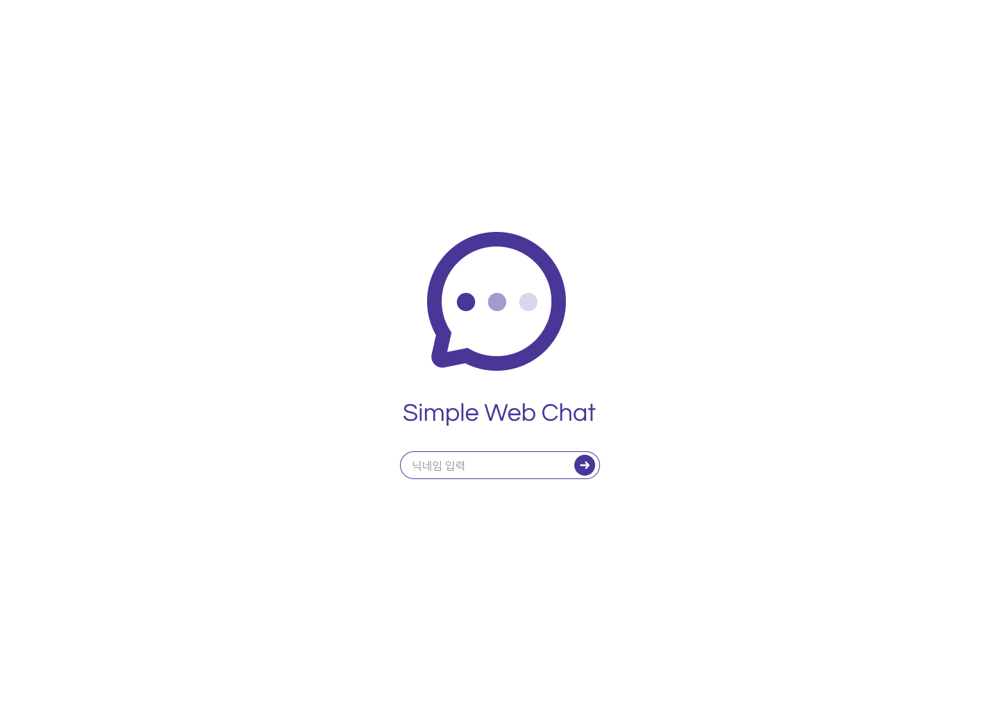
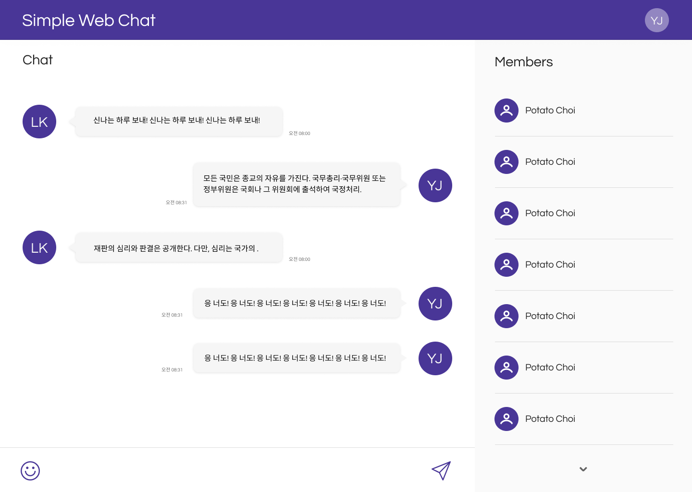

# 세 종류의 채팅 개발 방법

## 목차
1. [공통사항](#공통사항)
2. [화면구성](#화면구성)
3. [Polling](#polling)
4. [Socket.io](#socketio)
5. [Redis](#redis)
6. [개발에 필요한 핵심 함수](#채팅-개발에-필요한-핵심함수)
7. [채팅 화면 초기안](#채팅-화면-초기안)
8. [최종 디자인](#최종-디자인)
9. [개발 일정표](#개발-일정표)

## 공통사항

- 닉네임을 통해 서로를 구분한다.
- 채팅방을 나갔다 오더라도 채팅내역이 남아 있어야 한다.
- 채팅을 주고받을 수 있어야 한다.
- 메시지 구조는 닉네임, 메시지, 보낸 시간으로 이루어진다.
- 메시지 출력은 `유저명 : 메시지 : 보낸 시간` 구조로 화면에 그려진다.

#### 화면구성
1. 기본 채팅화면
    - index.html
    - 메인은 채팅 로그가 보일 공간
    - 하단에 유저가 채팅 메시지를 보낼 수 있는 입력 박스와 전송을 위한 버튼
    - 메시지 입력 박스 옆에 유저 닉네임을 정할 수 있는 입력 박스 추가

__socket.io__ 추가 페이지

2. 입장화면
    - index.html
    - 채팅화면 : chat.html (구조는 동일하나 닉네임 입력 박스가 없고 유저 목록을 보여주는 박스가있다.)
    - 닉네임을 정할 입력 박스와 접속을 위한 버튼이 있다.
    - 닉네임을 정하고 접속 버튼을 누르면 채팅화면으로 넘어간다. 

---

## Polling

#### 핵심
- 클라이언트에서 주기적으로 서버에 변경사항을 요청해 결과를 확인한다.
- 서버는 변경 여부에 관계없이 클라이언트에 응답한다.
- 요청 주기가 짧으면 불필요한 트래픽이 발생할 수 있다.
- 실시간 채팅이 가능하지만 권장하지는 않는다.

#### 기본 구조
1. 클라이언트에서 채팅 메시지를 가공하여 서버로 보낸다.
2. 서버에서는 받은 메시지를 JSON 형태로 저장한다.
3. 클라이언트 측에서 주기적으로 서버에 변경사항을 요청한다.
4. 서버 측에서는 요청을 받고 해당 요청에 대한 응답을 클라이언트 측으로 보낸다.
5. 클라이언트는 받아온 응답에 대한 결과를 화면에 그린다.
6. 퇴장하고 재입장할 때 저장된 JSON을 서버 측에서 받아와 화면에 그려준다.

### 클라이언트

#### 메시지
1. 메시지 객체를 서버로 요청을 보낸다. 형태는 `닉네임 : 메시지 : 보낸 시간` 이다.
2. 클라이언트는 `/message` 주소로 요청을 주기적으로 보내 받아온 응답을 화면에 그린다.
3. 입장 시 `/message` 주소로 요청을 보내고 받아온 응답을 화면에 그려준다.

### 서버

#### URL
- `/` : 채팅화면
- `/message` : 메시지를 저장할 공간

#### 메시지
1. 클라이언트로부터 날아온 객체를 JSON 형태로 `/message` 주소에 저장한다.
2. 클라이언트로부터 주기적으로 날아온 요청에 `/message` 주소에 저장된 JSON 객체로 응답한다.

---

## Socket.io

#### 핵심
- 실시간으로 상호작용하는 웹 서비스를 만드는 기술인 웹 소켓을 쉽게 사용할 수 있게 해주는 모듈
- `connection`, `disconnect`, `사용자 정의` 이벤트를 통해 각 작업을 매칭할 수 있다.
- 실시간이 가능하므로 채팅방 접속, 퇴장, 닉네임 변경 등의 사항을 적용할 수 있다.

#### 기본구조
1. 클라이언트에서 메시지를 가공하여 해당 이벤트로 서버에 요청한다.
2. 서버에서 요청받은 이벤트를 확인하고 JSON 형태로 `/message` 주소에 저장하고 곧바로 응답 이벤트를 보낸다.
3. 클라이언트는 서버에서 온 응답 이벤트를 토대로 화면에 바로바로 그려준다.
4. 퇴장하고 재입장할 때 지정된 이벤트로 저장된 JSON을 서버 측에서 받아와 화면에 그려준다.

### 클라이언트

#### 입장
- 메인화면에서 닉네임을 정하고 접속 버튼을 눌러 채팅방에 접속한다.
- 입장 후 서버로부터 온 이벤트를 토대로 화면 우측 접속자 명단에 추가된다.

#### 메시지
- 메시지에 대한 이벤트를 서버에 요청하고 서버는 해당 이벤트의 메시지를 별도의 공간에 저장하고 클라이언트에게 곧바로 응답 이벤트를 보낸다.
- 서버로부터 받은 메시지를 화면에 그려준다.

#### 이벤트
- 서버 소켓에 연결을 요청한다.
- 메시지, 입장, 퇴장 등의 이벤트를 이용한다.
- 이벤트를 이용하여 서버와 데이터를 교환한다.

### 서버

#### URL
- `/` : 입장화면
- `/chat` : 채팅화면
- `/message` : 메시지를 저장할 공간

#### 유저 관리
- 접속 시 설정한 닉네임을 받아서 기억한다.
- 해당 닉네임을 화면에 접속자 명단으로 제공해준다.
- 유저가 입장, 퇴장하면 메시지로 알려준다.

#### 이벤트
- 소켓의 생성 및 연결을 관리한다.
- 메시지, 입장, 퇴장 등의 이벤트를 관리한다.
- 이벤트를 이용하여 클라이언트와 데이터를 교환한다.

---

## Redis

#### 핵심
- pub(Publish)으로 보내고, sub(Subscribe)으로 받는다.
- 채팅방에 해당하는 Topic을 만든다.
- 메시지 수신자는 해당 Topic을 구독(Subscribe)한다.
- 송신 메시지는 해당 Topic에 출판(Publish)한다.
- 수신자 모두 Topic에 sub 된 상태이므로 pub 된 메시지를 받아볼 수 있다.
- pub/sub은 메시지를 저장하지 않기 때문에 다시 메시지를 받고 싶다면 pub 해야 한다.

#### 기본구조
- 클라이언트는 채널을 구독(Subscribe)한다.
- 채널에 구독자들은 모두 하나의 채팅방에 있는 것과같다.
- 출판(Publish)을 통해 메시지를 전송한다.
- 서버에서 Publish를 받아서 구독하고 있는 전체 클라이언트에게 보내준다.
- 클라이언트는 받은 메시지 내용을 화면에 그린다.

#### 유저
- 채널을 구독(Subscribe)하고 메시지를 Publish 한다.
- Subscribe 한 채널에서 메시지가 오면 받아서 화면에 그려준다.

### 서버
- redis-server와 연결한다.
- 채널을 생성하고 Publish와 Subscribe를 관리한다.
- Publish 된 내용이 있으면 해당 채널의 모든 Subscribe에게 전달한다.

---

# 채팅 개발에 필요한 핵심함수

## 클라이언트
1. 메시지 전송
    - 전송 버튼을 클릭 시 닉네임, 메시지, 보낸시간을 가공하여 서버로 보낸다.

2. 메시지 송신
    - 메시지를 요청하고 서버로부터 날아온 응답을 받는다.

3. 화면에 메시지 출력
    - 서버로부터 날아온 메시지를 화면에 그려준다.

4. 접속 시 기존 채팅 내역 출력
    - 재접속 시 기존의 채팅 내역을 그려준다.

5. 서버 연결
    - 구동중인 서버에 접속한다.

6. 유저 정보 관리
    - 참여자 명단을 그리기 위해 서버로 유저 정보를 보낸다.

7. 서버 소켓 연결
    - 서버 소켓에 연결을 요청한다.

## 서버
1. 서버 구동
    - 기본적인 HTML, CSS, JS 를 정적파일로 홈페이지를 보여준다.
    - 해당하는 URL 주소에 맞는 HTML 파일을 보여준다.

2. 메시지 저장
    - 클라이언트로부터 날아온 메시지를 기록하기 위해 JSON으로 가공하여 저장한다.

3. 메시지 전송
    - 화면에 그려주기 위해 클라이언트의 요청에 응답한다.

4. 기존 채팅 내역 전송
    - 재 접속 시 채팅 내역을 다시 그리기 위해 클라이언트에게 저장된 JSON을 보내준다.

5. 유저 관리
    - 참여자를 순서대로 받아 화면에 출력하기 위해 클라이언트에게 보내준다.

6. 소켓 생성 및 관리
    - 소켓을 생성하고 클라이언트와의 연결을 관리한다.

---

# 채팅 화면 초기안

메인 색상 테마 : white( #fff )
포인트 색상 테마 : 선명한 자주색( #493697 )

__참고 레퍼런스__

- 채팅화면
[채팅화면 레퍼런스1](https://dribbble.com/shots/2820283-Support-Chat)
[채팅화면 레퍼런스2](https://www.123rf.com/photo_54513086_stock-vector-concept-chat-messages-web-interface-application-speech-bubbles-sms-messages-flat-simple-modern-desig.html0)

- 입장화면
[입장화면 레퍼런스1](https://tlk.io/)
[입장화면 레퍼런스2](https://clipartkorea.co.kr/search/preview.php?cont_code=tiw214f5905)

## 기본 채팅화면

1. 채팅화면 : 클라이언트의 채팅 목록을 그리기 위한 박스
2. 닉네임 입력 박스 : Polling으로 작성시 고전 느낌을 위해 배치한다.
3. 채팅 입력 박스 : 채팅을 입력하기 위한 박스
4. 전송버튼 : 채팅을 보내기 위한 버튼

## 메인 화면

1. 로고 : 페이지 로고
2. 타이틀 : 페이지 이름
3. 닉네임 입력 박스 : 클라이언트의 닉네임을 정하는 박스
4. 입장버튼 : 정한 닉네임을 가지고 채팅화면으로 이동하는 버튼

## 채팅 화면

- 닉네임 입력 박스가 사라지고 접속자 명단 박스에 유저의 닉네임을 그린다.

---

# 최종 디자인

## 기본 채팅화면
- Polling 방식에서 사용될 예정 (고전느낌)

## 메인 화면

## 채팅 화면

---

# 개발 일정표

<table style="text-align:center;">
    <thead>
        <tr>
            <th>일</th>
            <th>월</th>
            <th>화</th>
            <th>수</th>
            <th>목</th>
            <th>금</th>
            <th>토</th>
        </tr>
    </thead>
    <tbody>
        <tr>
            <td></td>
            <td></td>
            <td></td>
            <td></td>
            <td></td>
            <td></td>
            <td>1</td>
        </tr>
        <tr>
            <td></td>
            <td></td>
            <td></td>
            <td></td>
            <td></td>
            <td></td>
            <td></td>
        </tr>
        <tr>
            <td style="color: red;">2</td>
            <td>3</td>
            <td>4</td>
            <td>5</td>
            <td>6</td>
            <td>7</td>
            <td>8</td>
        </tr>
        <tr>
            <td></td>
            <td></td>
            <td></td>
            <td></td>
            <td>네트워크 통신 .md 작성</td>
            <td>인메모리 스토리지 .md 작성</td>
            <td></td>
        </tr>
        <tr>
            <td style="color: red;">9</td>
            <td>10</td>
            <td>11</td>
            <td>12</td>
            <td>13</td>
            <td style="color: red;">14</td>
            <td style="color: red;">15</td>
        </tr>
        <tr>
            <td></td>
            <td>도커 컨테이너 .md 작성</td>
            <td colspan='3'><---------------------> 채팅 설계 작성 및 검토</td>
            <td style="color: red;">휴가</td>
            <td style="color: red;">광복절</td>
        </tr>
        <tr>
            <td style="color: red;">16</td>
            <td style="color: red;">17</td>
            <td>18</td>
            <td>19</td>
            <td>20</td>
            <td>21</td>
            <td>22</td>
        </tr>
        <tr>
            <td></td>
            <td style="color: red;">임시 공휴일</td>
            <td colspan='2'><----------------->  테스트케이스 작성</td>
            <td colspan='2'><------------------------   개발 시작</td>
            <td></td>
        </tr>
        <tr>
            <td style="color: red;">23</td>
            <td>24</td>
            <td>25</td>
            <td>26</td>
            <td>27</td>
            <td>28</td>
            <td>29</td>
        </tr>
        <tr>
            <td></td>
            <td colspan='3'>-----------------------> 개발 코드 작성</td>
            <td colspan='2'>개발 마무리 및 테스트</td>
            <td></td>
        </tr>
        <tr>
            <td style="color: red;">30</td>
            <td>31</td>
        </tr>
        <tr>
            <td></td>
            <td></td>
        </tr>
    </tbody>
</table>