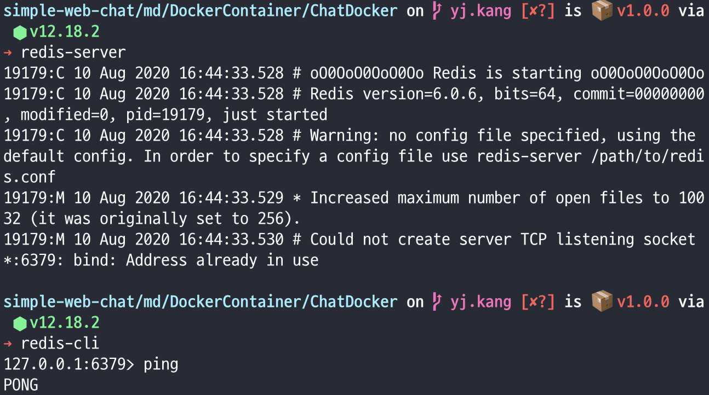

# 채팅 개발 환경 도커 생성

앞서 Docker를 설치하고 간단하게 컨테이너를 생성해서 연결하고 실행하는 방법에 대해 알아봤다.

node.js 와 express, redis 를 채팅 개발환경을 위해 테스트로 만들어 보려고 한다.

## 개발환경 구성하기

1. 도커 컴포즈용 폴더를 하나 생성한다.

```
> mkdir ChatDocker
> cd ChatDocker
```

2. node 프로젝트를 생성

```
npm init
```
해당 폴더에 `packages.json` 파일이 생성된다.

```json
{
  "name": "simple-web-chat-test",
  "version": "1.0.0",
  "description": "",
  "main": "index.js",
  "scripts": {
    "test": "echo \"Error: no test specified\" && exit 1"
  },
  "author": "",
  "license": "ISC"
}
```

3. node 패키지 생성

```
> npm install --save express
> npm install --save redis
```

설치가 완료되면 `package.json` 파일을 확인한다.

```json
{
  "name": "simple-web-chat-test",
  "version": "1.0.0",
  "description": "",
  "main": "index.js",
  "scripts": {
    "test": "echo \"Error: no test specified\" && exit 1"
  },
  "author": "",
  "license": "ISC",
  "dependencies": {
    "express": "^4.17.1",
    "redis": "^3.0.2"
  }
}
```

`dependencies`에 잘 추가되었다.

4. 간단한 app.js 파일을 작성한다.


###### redis-server에 접속하는 express 서버
```js
const express = require('express');
const redis = require('redis');

let app = express();

const client = redis.createClient(6379, "127.0.0.1");

let redisValue = ""; // redis Value를 담을 변수

client.on('connect', () => { // redis 연결 성공시
   console.log('Connected'); 
});

client.on('error', (err)  => { // redis 연결 실패시
    console.log(`연결할 수 없습니다. ${err}`);
});

client.set('name', 'Kang', (err, reply) => { // name이라는 key에 value로 "Kang"을 넣는다.
    console.log(reply);
});

client.get('name', (err, reply) => { // name key 에서 value를 받아온다.
    console.log(reply);
    redisValue.push(reply);
})

app.get('/', (req, res) => { // http://127.0.0.1:3000/
    res.send("Main");
});

app.get('/redis', (req, res) => { // http://127.0.0.1:3000/redis
    res.send(redisValue); // 받아온 Value를 그려준다.
})

app.listen(3000, () => {
    console.log("http://127.0.0.1:3000");
});
```

5. 로컬에서 redis 실행 테스트를 한다.
###### redis 설치
```
> brew install redis
```

###### redis 실행
```
> redis-server
```



redis-cli 를 통해 ping PONG 을 잘 주고 받는다.
정상적으로 서버가 실행중이다.

6. 로컬에서 node 실행 테스트를 한다.

실행에 앞서 `packages.json`을 수정한다.

```json
{
  "name": "simple-web-chat-test",
  "version": "1.0.0",
  "description": "",
  "main": "app.js",
  "scripts": {
    "test": "echo \"Error: no test specified\" && exit 1",
    "start": "node app.js"
  },
  "author": "",
  "license": "ISC",
  "dependencies": {
    "express": "^4.17.1",
    "redis": "^3.0.2"
  }
}
```

메인 서버가 app.js 이므로 `"main"`을 index.js 에서 app.js 로 변경한다.

`"scripts"`에 `"start": "node app.js"` 명령어를 추가해준다.

```
> npm start

```


정상적으로 redis-server에 연결되고 "name"에 "kang"을 `Set`, `Get` 하는것도 문제 없이 완료되었다.


`http://127.0.0.1:3000/redis` 로 접속해보니 받아온 데이터도 정상적으로 뿌려준다.

앞서 모든 테스트가 완료되었다.
이제 도커 파일을 생성한다.

###### Dockerfile 생성
프로젝트 폴더에 Dockerfile을 생성해준다.

```dockerfile
#어떤 이미지로부터 새로운 이미지를 생성할지를 지정
FROM node:12

# Dockerfile을 생성/관리하는 사람
MAINTAINER YongJun Kang <yj.kang@zipida.com>

# /app 디렉토리 생성
RUN mkdir -p /app

# /app 디렉토리를 WORKDIR로 설정
WORKDIR /app

# 현재 Dockerfile이 잇는 경로의 모든 파일을 /app 에 복사하기 위해 추가
ADD . /app

# npm install 을 실행해서 모듈을 받는다
RUN npm install

# 환경변수 NODE_ENV의 값을 development 로 설정
ENV NODE_ENV development

# 가상 머신에서 오픈할 포트
EXPOSE 3000

# 컨테이너에서 실행될 명령을 지정
CMD ["npm", "start"]
```

차근차근 알아보자.

`FROM` : 베이스가 될 이미지 node:12 LTS 버전

`MAINTAINER` : DockerFile 을 생성/관리하는 사람을 명시

`RUN mkdir -p /app` : app 이라는 디렉토리를 만들어준다.

`WORKDIR /app` : app 디렉토리를 `WORKDIR`로 지정

`ADD . /app` : 현재 DockerFile이 있는 디렉토리의 모든 파일을 /app 에 복사한다.

`RUN npm install` : npm install 명령을 통해 package.json의 모듈들을 설치해준다.

`ENV NODE_ENV` : NODE_ENV를 개발로 설정한다.

`EXPOSE` : 가상 머신에서 오픈할 포트는 3000번이다.

`CMD ["npm", "start"]` : 마지막으로 npm start 명령어를 가상환경에서 실행한다.

##### DockerIgnore
제외하고 싶은 파일을 추가한다.
```
**/node_modules
```

##### docker-compose.yml 파일생성

###### Docker-Compose란?
여러 Docker container들을 하나의 yml 파일로 관리하게 도와준다.

container 들을 실행하면, 하나의 network를 만들어 container 들을 묶고, 통신할 수 있게 되어 다양한 서비스를 붙이는 데에 매우 효과적입니다.

- 파이썬 기반으로 작성되어 있기 때문에 yml을 확장자로 사용한다.
- links를 통해서 컨테이너끼리 접근할 수 있다.

```yml
#docker-compose의 버전을 명시. 버전별로 명령어등의 약간의 차이가 있다.
version: "2"

services:
    redis-server:
        image: "redis"
        command: redis-server --port 6379
        ports:
            - 6379:6379
    node-app:
        build: .
        ports:
            - "3000:3000"
```
`redis-server, node-app` : 컨테이너 이름이 된다.

`version` : docker-compose의 버전으로 버전별로 명령어등의 약간의 차이가 있다.

`image` : redis 이미지를 명시

`command` : redis-server 를 실행하고 포트는 6379로 한다.

`build` : Dockerfile의 위치

`ports` : 열어줄 포트, 호스트와 연결할 포트:외부에 노출할 포트

###### app.js 파일 수정
```js
const express = require('express');
const redis = require('redis');

let app = express();

const client = redis.createClient(6379, "redis-server");

// ...
```

`redis.createClient(포트, 호스트)` 
호스트 부분을 yml에 만든 도커 컨테이너 이름에 연결한다.

#### 테스트

```
> docker-compose up --build
```
up --build 옵션은 docker-compose.yml 파일의 내용에 따라 이미지를 생성하고 yml에 명시된 각각의 컨테이너를 만들어 연결시켜준다.


`Creating chatdocker_redis-server_1 ... done`

`Creating chatdocker_node-app_1 ... done`

을 통해 node_app 과 redis-server 의 컨테이너가 생성된걸 알 수 있다.

데이터도 이상 없이 잘 받아온다.


###### Docker-Compose 과정
1. 서비스를 띄울 네트워크를 설정
2. 필요한 볼륨 생성 (혹은 이미 존재하는 볼륨과 연결)
3. 필요한 이미지 풀(pull)
4. 필요한 이미지 빌드(build)
5. 서비스 의존성에 따라 서비스 실행

###### up 옵션 명령어
- -d : 서비스를 실행 후 콘솔로 빠져나온다.
- --force-recreate : 컨테이너를 지우고 새로 만든다.
- --build : 서비스 시작 전 이미지를 새로 만든다.

자세한 내용 : [도커 컴포즈를 활용한 완벽한 개발 환경 구축하기](https://www.44bits.io/ko/post/almost-perfect-development-environment-with-docker-and-docker-compose)


## dockerfile 이미지 만들기
__Docker build__

```
docker build [OPTIONS] PATH | URL | -
생성할 이미지 이름을 지정하기 위한 -t(--tag) 옵션만 알면 빌드가 가능하다.

> docker build -t app .
```


dockerfile 에 명시된 명령어에 따라 순차적으로 진행하며 build 한다.

__이미지 생성확인__

```
> docker images
```


node:12 에 app 레이어가 추가된 새로운 이미지가 생성된것을 확인할 수 있다.

__이미지 컨테이너로 실행__

```
> docker run -d -p 3000:3000 app
```

이미지가 실행되면서 dockerfile의 명령어를 순차적으로 입력하게 된다.

`http://127.0.0.1:3000/` 으로 접속해보면 이상 없이 node.js의 express가 구동되는걸 확인할 수 있다.