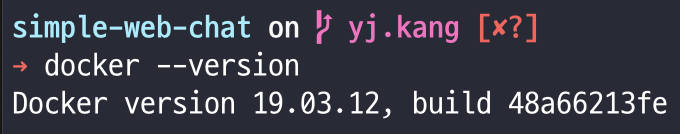

# 도커(docker)의 개념과 설치

## 개념

__서비스 형태의 플랫폼__(Platform-as-a-service, PaaS)은 서비스 제공업체가 고객에게 플랫폼을 제공함으로써 고객이 일반적으로 소프트웨어 개발 프로세스에 필요한 인프라를 구축하고 유지할 필요 없이 비즈니스 애플리케이션을 개발, 실행, 관리할 수 있도록 하는 클라우드 컴퓨팅의 시대를 말한다.

그 시대를 이끌고 있는 대표주자가 바로 [Docker](https://www.docker.com/) 이다.

### 도커는 __컨테이너 기반의 오픈소스 가상화 플랫폼__ 이다.
컨테이너를 관리하는 플랫폼

다양한 프로그램, 실행환경을 __컨테이너로 추상화하고 동일한 인터페이스__ 를 제공하여 프로그램의 배포 및 관리를 단순하게 해준다.

백엔드 프로그램, 데이터베이스 서버, 메시지 큐등 어떤 프로그램도 컨테이너로 추상화할 수 있고 조립PC, AWS, Azure, Google cloud등 어디에서든 실행할 수 있다.

### 컨테이너란?
배에 실는 네모난 화물 수송용 박스를 생각할 수 있다.
각각의 컨테이너 안에 다양한 화물을 넣을 수 잇고 규격화되어 컨테이너선이나 트레일러등 다양한 운송수단으로 쉽게 옮길 수 있다.

Docker에서 컨테이너는 동일하지만 격리된 공간에서 프로세스가 동작하는 기술이다.
가상화 기술의 하나지만 기존 방식과는 차이가 있다.

기존의 가상화 방식은 주로 __OS를 가상화__ 했다.

VMware나 VirtualBox같은 가상머신은 호스트 OS위에 게스트 OS 전체를 가상화하여 사용하는 방식이다. 이 방식은 여러가지 OS를 가상화 할 수 있고 비교적 사용법이 간단하지만 무겁고 느려서 운영환경에선 사용할 수 없었다.

어떤 가상화 방식이든 추가적인 OS를 설치하여 가상화하는 방법은 성능문제가 있었고 이를 개선하기 위해 __프로세스를 격리__ 하는 방식이 등장한다.


리눅스에서는 이 방식을 리눅스 컨테이너라고 하고 단순히 프로세스를 격리시키기 때문에 가볍고 빠르게 동작한다. CPU나 메모리는 딱 프로세스가 필요한 만큼만 추가로 사용하고 성능적으로도 손실이 거의 없다.

하나의 서버에 여러개의 컨테이너를 실행하면 서로 영향을 미치지 않고 독립적으로 실행되어 마치 가버운 가상화머신을 사용하는 느낌을 준다. 실행중인 컨테이너에 접속하여 명령어를 입력할 수 있고 `apt-get` 이나 `yum` 등으로 패키지를 설치할 수 있으며 사용자도 추가하고 여러개의 프로세스를 백그라운드로 실행할 수도 있다. CPU나 메모리 사용량을제한할 수 있고 호스트의 특정 포트와 연결하거나 호스트의 특정 디렉토리를 내부 디렉토리인 것처럼 사용할 수 있다.

장점으로는 새로운 컨테이너를 만드는데 걸리는 시간은 가상머신과 비교도 할 수 없이 빠르다.

### 이미지


이미지는 __컨테이너 실행에 필요한 파일과 설정값등을 포함하는 것__ 으로 상태값을 가지지 않고 변하지 않는다(Immutable). 컨테이너는 이미지를 실행한 상태라고 볼 수 있고 추가되거나 변하는 값은 컨테이너에 저장된다. 같은 이미지에서 여러개의 컨테이너를 생성할 수 있고 컨테이너의 상태가 바뀌거나 컨테이너가 삭제되더라도 이미지는 변하지 않고 그대로 남아있다.

그림과 같이 Image를 컨데이너에 담고 실행을 시킨다면 해당 프로세스가 동작하게 된다. 이미지를 어떻게 만드는지 알기 위해서 과정을 알아보자.


ubuntu 이미지를 만들기 위해 Layer A,B,C가 들어간다.
그럼 nginx 이미지를 만든다고 생각했을때 이미 Layer A, B, C, nginx 가 더해진 것이지만 과정은 ubuntu + nginx 가 더해진 것이다. 그렇다면 web app 이미지를 만들려면 어떻게 해야 할까? ubuntu 이미지에 nginx를 올리고 web app을 올리는 것이 아닌 이미 만들어진 nginx 베이스 이미지에 web app을 올려 이미지를 만들게 된다.

이미지는 컨테이너를 실행하기 위한 모든 정보를 가지고 있기 때문에 더 이상 의존성 파일을 컴파일하고 이것저것 설치할 필요가 없다. 새로운 서버가 추가되면 미리 만들어 놓은 이미지를 다운받고 컨테이너를 생성하면 된다. 한 서버에 여러개의 컨테이너를 실행할 수 있고, 수십, 수백, 수천대의 서버도 문제없다.

도커 이미지는 컨테이너를 실행하기 위한 모든 정보를 가지고 있기 때문에 보통 용량이 수백메가에 이른다. 처음 이미지를 다운 받는다면 매우 비효율적일 수 밖에 없다.

이런 문제를 해결하기 위해 레이어라는 개념을 사용하고 유니온 파일 시스템을 이용하여 여러개의 레이어를 하나의 파일시스템으로 사용할 수 있게 해준다. 

이미지는 여러개의 읽기 전용 레이어로 구성되고 파일이 추가되거나 수정되면 새로운 레이어가 생성된다.

도커 이미지는 [Docker hub](https://hub.docker.com/)에 등록하거나 [Docker Registy](https://docs.docker.com/registry/) 저장소를 직접 만들어 관리할 수 있다.


이미지는 url 방식으로 관리하며 태그를 붙일 수 있다.
ubuntu 14.04 이미지는 `docker.io/library/ubuntu:14.04` 또는 `docker.io/library/ubuntu:trusty` 이고 `docker.io/library`는 생략가능하며 `ubuntu:14.04`로 사용할 수 있다.

### Docker File

도커 이미지를 만들기 위해 `Dockerfile` 이라는 파일에 자체 DSL(Domain-specific-language) 언어를 이용하여 이미지 생성 과정을 적는다. 여러가지 명령어를 토대로 Docker File을 작성하면 설정된 내용대로 Docker Image를 만들 수 있다.


## 설치
[Docker 설치페이지](https://docs.docker.com/get-docker/)

[맥 Docker 설치페이지](https://hub.docker.com/editions/community/docker-ce-desktop-mac/)

1. Docker 홈페이지에 접속하여 해당 운영체제에 맞는 버전을 설치해준다.
- 운영체제를 선택하면 docker hub로 이동하게된다.


2. MAC 에서는 해당 애플리케이션을 폴더로 이동시키고 실행하면 접근권한이 필요하다고 나온다. 접근권한을 주면 설치가 끝난다.


3. 터미널을 통해 설치 버전을 확인한다.
```
> docker --version
```


4. 우측 상단에서 도커 아이콘을 발견할 수 있다.
메뉴에서 설정 등 다양한 GUI 옵션이 지원된다.


5. 도커 파일로 빌드하기
```
>> docker build -t yjkang
// docker built -t [이미지 이름][디렉토리]
```

6. 도커 이미지 확인
```
>> docker images
```

7. 가상머신 생성하기
```
>> docker run -t -i -p 8080:8080 --name yjkang ubuntu:latest /bin/bash
// docker run -t -i -p [외부포트:내부포트] --name [가상머신이름] [이미지이름] /bin/bash
```

###### 도커(docker) 명령어

|      제목     |   명령어  |
|:--------------|:-----------|
|    버전확인   | $docker -v|
|이미지 다운로드| $docker pull [이미지명]|
|다운로드된 이미지 목록| $docker images|
|컨테이너 생성  | $docker create [옵션] [이미지 명]|
|컨테이너 생성 및 실행| $docker run [옵션] [이미지 명]|
|컨테이너 실행  | $docker start [컨테이너 명]|
|컨테이너 재실행 | $docker restart [컨테이너 명]|
|컨테이너 접속 | $docker attach [컨테이너 명]|
|컨테이너 정지 | $docker stop [컨테이너 명]|
|실행중인 컨테이너 목록 | $docker ps|
|정지된 컨테이너 목록 | $docker ps -a|
|컨테이너 명 변경 | $docker rename [기존 컨테이너 명] [새로운 컨테이너 명]|
|컨테이너 삭제 | $docker rm [컨테이너 명]|
|이미지 삭제 | $docker rmi [이미지 명]|
|도커 머신 삭제| $docker rm -f [컨테이너 명]|
|도커 머신으로 파일 복사| $docker cp [소스파일] [머신이름:디렉토리]|
|도커 머신에서 파일 가져오기|  $docker cp [머신이름:소스파일] [디렉토리]|


--- 

출처1 : [Docker정리](https://cultivo-hy.github.io/docker/image/usage/2019/03/14/Docker%EC%A0%95%EB%A6%AC/)

출처2 : [초보를 위한 도커 안내서](https://subicura.com/2017/01/19/docker-guide-for-beginners-1.html)

출처3 : [Docker 개념](https://khj93.tistory.com/entry/Docker-Docker-%EA%B0%9C%EB%85%90)