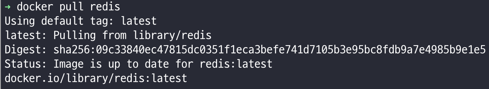
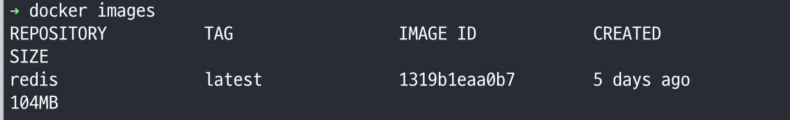
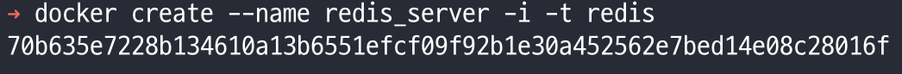
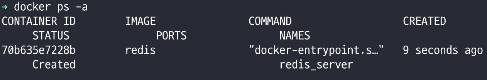
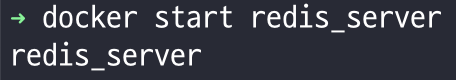
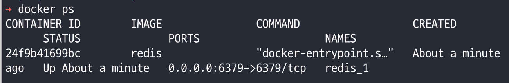
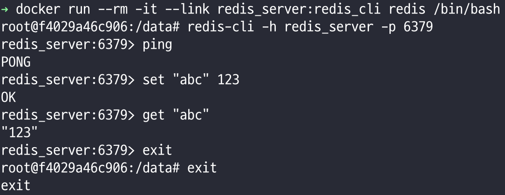

# 도커(docker) 컨테이너 생성과 사용

## 컨테이너 실행하기
```
> docker run [OPTIONS] IMAGE:[:TAG|@DIGEST] [COMMAND] [ARG...]
```
|옵션|설명|
|----|----|
|-d | detached mode [백그라운드 모드]|
|-p | 호스트와 컨테이너의 포트를 연결 (포워딩)|
|-v | 호스트와 컨테이너의 디렉토리를 연결 (마운트) |
|-e | 컨테이너 내에서 사용할 환경변수 설정|
|-name | 컨테이너 이름 설정|
|-rm | 프로세스 종료시 컨테이너 자동 제거|
|-it | -i 와 -t 를 동시에 사용한 것으로 터미널 입력을 위한 옵션|
|-link | 컨테이너 연결 [컨테이너명:별칭]|

### redis 컨테이너 생성하기

#### 도커 이미지 가져오기
```
> docker pull redis
// 버전을 명시하지 않았기 때문에 최신버전으로 받는다.
```



#### 이미지 확인
```
> docker images
// 다운받은 이미지를 확인할 수 있다.
```



#### 컨테이너 생성하기
```
> docker create [옵션] [이미지 이름]:[태그]
> docker create --name redis_server -i -t redis
// -i 는 상호 출력, -t 는 bash 쉘을 사용
```



#### 컨테이너 확인
```
> docker ps -a
```



#### 컨테이너 실행
```
> docker start redis_server
// --name 옵션을 지정해줬다면
> docker start redis_1
```



#### 컨테이너 들어가기
```
> docker attach redis_server
// 만들어진 컨테이너로 접속한다.
// ctrl + c 를 이용해서 빠져나온다.
```

### redis 컨테이너 생성과 실행
`생성 -> 실행 -> 들어가기` 까지 한번에 해주는 명령어이다.

```
> docker run --name redis_server -d -p 6379:6379 -v /project/dockerExample redis
// -d 옵션이 없으면 프로세스가 foreground로 실행되어 아무키도 입력할 수 없게 된다.
// 컨테이너를 종료하려면 ctrl + c 를 이용한다.
// 이미지가 없다면 버전을 명시하지 않았기에 자동으로 최신 버전을 pull 한다
```

1. 컨테이너를 redis_server 이라는 이름으로 생성한다.
2. 백그라운드 모드로 실행한다.
3. 내부포트와 외부포트는 동일하게 6379이다. 내부포트를 이용해 외부포트로 접근한다.
4. /project/dockerExample 폴더를 지정한다.
5. redis를 실행한다.

###### 생성된 컨테이너 확인
```
> docker ps
// 컨테이너 확인
```



#### 생성된 컨테이너 중지
```
> docker stop redis_server
// 실행중인 컨테이너를 중지한다.
> docker stop $(docker ps -aq)
// 모든 컨테이너를 중지한다.
```

#### 생성된 컨테이너 삭제
```
> docker rm redis_server
// 프로세스를 종료한다.
> docker rm $(docker ps -aq)
// 모든 컨테이너를 삭제한다.
```

## 사용

앞서 redis_server 컨테이너를 만들었다.

실행이 완료된 redis_server 컨테이너에서 `redis-cli` 도구를 사용하기 위해 새로운 컨테이너를 생성하고 앞서 생성한 redis_server 컨테이너와 연결해준다.

```
> docker run --rm -it --link redis_server:redis_cli redis /bin/bash
```

연결된 컨테이너에서 redis-cli 를 redis_server 6379번 포트로 접속한다.

```
root@컨테이너 상태: /data # redis-cli -h redis_server -p 6379
redis_server:6379 > 명령어 실행
```



간단하게 이미지를 다운받아서 컨테이너를 만들고,
만들어진 컨테이너를 실행해서 사용하는 방법을 배웠다.

출처 : [docker에서 레디스 사용하기](https://snowdeer.github.io/docker/2018/02/18/docker-example-of-using-redis/)

참고 : [docker 레디스 사용](https://jistol.github.io/docker/2017/09/01/docker-redis/)

막힌다면 : [docker 레디스 삽질](https://real-dongsoo7.tistory.com/127)

기본사용법 : [docker 기본 사용법](http://pyrasis.com/Docker/Docker-HOWTO)

Node.js 등 다양한 환경을 컨테이너를 통해 실행할 수 있는걸 확인했다.


