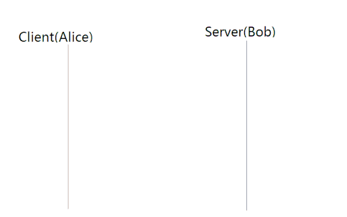

# 네트워크프로그래밍

### OSI 모델과 TCP/IP 모델 비교
TCP/IP 프로토콜은 OSI 모델보다 먼저 개발되었다.

그러므로 TCP/IP 프로토콜의 계층은 OSI 계층과 정확하게 일치하지 않는다.

두 계층을 비교할 때, 세션(Session)과 표현(presentation) 2개의 계층이 TCP/IP 프로토콜 그룹에 없다는 것을 알 수 있다.

두 모델 모두 계층형이라는 공통점을 가지고 있으며 OSI 7 Layer는 장비 개발과 통신 자체를 어떻게 표준으로 잡을지 사용되는 반면에 실질적인 통신 자체는 TCP/IP 프로토콜을 사용한다.

[출처 Information Security](http://goitgo.tistory.com/25)

### TCP/IP 4 Layer
|Layer|Layer Name|
|:--:|:--:|
|L4|응용 계층   (Application Layer)|
|L3|전송 계층   (Transport Layer)|
|L2|인터넷 계층   (Internet Layer)|
|L1|네트워크 엑세스   (Network Access Layer)|

__TCP/IP__ 는 현재 수많은 프로그램이 인터넷으로 통신하는 데 있어 가장 기반이 되는 프로토콜로 실제 대다수 프로그램은 TCP와 IP로 통신하고 있다.

#### 1계층 네트워크 엑세스 계층(Network Access Layer or Network Interface Layer)
- OSI 7 Layer에서 ==물리계층==과 ==데이터링크 계층==에 해당한다.
- OS의 네트워크 카드와 디바이스 드라이버 등과 같이 하드웨어적인 요소와 관련된 모든 것을 지원하는 계층
- ==송신 측 컴퓨터==의 경우 상위 계층으로부터 전달받은 패킷에 물리적인 주소로 MAC 주소 정보를 가지고 있는 헤더를 추가하여 프레임을 만들고, 프레임을 하위계층인 물리계층으로 전달한다.
- ==수신 측 컴퓨터==의 경우 데이터 링크 계층에서 추가된 헤더를 제거하여 상위 계층인 네트워크 계층으로 전달한다.

    - CSMA/CD, MAC, LAN, X25, 패킷망, 위성 통신, 다이얼 모뎀 등 ==전송에 사용==
    - 프로토콜 : Ethernet(이더넷), Token Ring, PPP

###### 요약정리
1. OSI 7계층의 물리계층과 데이터 링크 계층에 해당한다.
2. 물리적인 주소로 MAC을 사용한다.
3. LAN, 패킷망 등에 사용된다.
4. TCP/IP 패킷을 네트워크 매체로 전달하는 것과 네트워크 매체에서 TCP/IP 패킷을 받아들이는 과정을 담당한다.
5. 기본적으로 에러 검출 / 패킷의 프레임화를 담당한다.

#### 2계층 인터넷 계층(Internet Layer)
- OSI 7 Layer의 ==네트워크 계층==에 해당한다.
- 인터넷 계층의 주요 기능은 상위 트랜스포트 계층으로부터 받은 데이터에 IP 패킷 헤더를 붙여 IP 패킷을 만들고 이를 전송하는 것이다.
  
    - 통신 노드 간의 ==IP 패킷을 전송==하는 기능 및 라우팅 기능을 담당
    - 프로토콜 : IP, ARP, RARP, ICMP, OSPF

###### 요약정리
1. OSI 7계층의 네트워크 계층에 해당한다.
2. 통신 노드 간의 IP 패킷을 전송하는 기능과 라우팅 기능을 담당한다.
3. 논리적인 주소 IP를 이용한 노드 간 전송과 라우팅 기능을 처리하게 된다.
4. 네트워크상 최종 목적지까지 정확하게 연결되도록 연결성을 제공한다.

#### 3계층 전송 계층(Transport Layer)
- OSI 7 Layer에서 ==전송계층==에 해당한다.
- 네트워크 양단의 송수신 호스트 사이에서 신뢰성 있는 전송기능을 제공한다.
- 시스템의 논리 주소와 포트를 가지고 있어서 각 상위 계층의 프로세스를 연결해서 통신한다.
- 정확한 패킷의 전송을 보장하는 TCP와 정확한 전송을 보장하지 않는 UDP 프로토콜을 이용한다.
- 데이터의 정확한 전송보다 빠른 속도의 전송이 필요한 멀티미디어 통신에서 UDP를 사용하면 TCP보다 유용하다.

    - ==통신 노드 간의 연결을 제어==하고, 자료의 송수신을 담당
    - 프로토콜 : TCP, UDP

###### 요약정리
1. OSI 7계층의 전송 계층에 해당한다.
2. 통신 노드 간의 연결을 제어하고, 신뢰성 있는 데이터 전송을 담당한다.
3. 자료의 송수신을 담당한다.
4. 애플리케이션 계층의 세션과 데이터그램 통신서비스를 제공한다.

#### 4계층 응용 계층(Application Layer)
- OSI 7 Layer에서 ==세션 계층==, ==프레젠테이션계층==, ==애플리케이션 계층==에 해당한다.
- 응용프로그램들이 네트워크 서비스, 메일 서비스, 웹서비스 등을 할 수 있도록 표준적인 인터페이스를 제공한다.

    - TCP/IP 기반의 ==응용 프로그램==을 구분할 때 사용한다.
    - 프로토콜 : HTTP, FTP, Telnet, DNS, SMTP

###### 요약정리
1. OSI 7계층의 세션 계층, 표현 계층, 응용 계층에 해당한다.
2. TCP/UDP 기반의 응용 프로그램을 구현할 때 사용한다.
3. 다른 계층의 서비스에 접근할 수 있게 하는 애플리케이션 계층을 제공한다.
4. 애플리케이션들이 데이터를 교환하기 위해 사용하는 프로토콜을 정의한다.

###### 용어 요약정리
1. MAC 
 - Media Access Control 
 - 랜카드, 네트워크 장비들이 하나씩 가지고 있는 유일하고, 고정된 48bit 주소이다.
2. LAN
 - 근거리 통신망
 - 광대역 통신망과 달리 학교, 회사, 연구소 등 한 건물이나 일정 지역 내에서 컴퓨터나 단말기들을 고속 전송 회선으로 연결하여 프로그램 파일 또는 주변장치를 공유할 수 있도록 한 네트워크 형태
3. IP
 - 인터넷상에 있는 컴퓨터의 고유한 주소로 이것을 바탕으로 인터넷상의 한 컴퓨터에서 다른 컴퓨터로 데이터를 주고받을 수 있다.
4. HTTP
 - HyperText Transfer Protocol
 - WWW 상에서 정보를 주고받을 수 있는 프로토콜이다.
 - 주로 HTML 문서를 주고받는 데에 쓰인다.
 - TCP와 UDP를 사용하며, 80번 포트를 쓴다.
6. HTTPS
 - HyperText Transfer Protocol over Secure Socket Layer
 - WWW 통신 프로토콜인 HTTP의 보안이 강화된 버전이다.
 - SSL이나 TLS 프로토콜을 통해 세션 데이터를 암호화한다.
 - 443포트를 쓴다.
7. FTP
 - 파일 전송 프로토콜
 - TCP/IP 프로토콜을 가지고 서버와 클라이언트 사이의 파일을 전송하기 위한 프로토콜이다.
8. Telnet
 - 인터넷을 통하여 원격지의 호스트 컴퓨터에 접속할 때 지원되는 인터넷 표준 프로토콜
 - TCP/IP 프로토콜 기반으로 23번 포트가 기본적인 규약이다.
 - 보안성을 위해 사용자가 포트를 변경할 수 있다.
9. DNS
 - 도메인 네임 시스템(Domain Name System)
 - 호스트의 도메인 이름을 호스트의 네트워크 주소로 바꾸거나 그 반대의 변환을 수행할 수 있도록 하기 위해 개발되었다.
10. #### handshaking(중요)
 - 통신의 양측 간에 조건에 합의해가는 정보 교환 과정에 붙이는 용어

#### TCP 3방향 핸드 셰이크
1. 최초의 호스트(Alice)가 두 번째 호스트(Bob)에 SYN(동기화) 메시지를 보낸다.
이 메시지에는 자체 시퀸스 번호 x가 있으며, 이것을 Bob이 받는다.
2. Bob은 SYN-ACK 메시지와 함께 응답한다. 
이 메시지는 자체 시퀸스 번호 y와 응답 번호 x+1을 포함하며, Alice가 이를 받는다.
3. Alice는 응답 메시지와 함께 응답한다.
이 메시지는 응답 번호 y+1이 포함되며 Bob이 이것을 받지만 이에 응답할 필요는 없다.

## TCP/UDP
전송계층에 사용하는 프로토콜로써, 목적지 장비까지 전송한 패킷을 상위의 특정 응용 프로토콜에 전달하는 것에 목적이 있다.

전송계층
- 송신자와 수신자를 연결하는 통신 서비스를 제공하는 계층
- 데이터의 전달을 담당한다.

TCP는 연속성보다 신뢰성 있는 전송이 중요할 때에 사용하는 프로토콜

UDP는 TCP보다 빠르며 네트워크 부하가 적다는 장점이 있지만, 신뢰성 있는 데이터 전송을 보장하지 않는다. 그러므로 신뢰성보다는 연속성이 중요한 서비스의 예로 실시간 서비스(Streaming)에 자주 사용된다.

### TCP
__Transmission Control Protocol__

연결형 서비스를 지원하는 전송계층 프로토콜로써, 인터넷 환경에서 기본적으로 사용한다.

호스트 간 신뢰성 있는 데이터 전달과 흐름 제어를 한다.
즉, 인터넷상에서 데이터를 메시지의 형태로 보내기 위해 IP와 함께 사용하는 프로토콜이다.

일반적으로 TCP와 IP를 함께 사용하는데, IP가 데이터의 배달을 처리한다면 TCP는 패킷을 추적 및 관리하게 된다.

#### 특징
1. 연결형 서비스로 가상 회선 방식을 제공한다.
2. 데이터의 경계를 구분하지 않는다
3. 데이터의 전송 순서를 보장한다.
4. UDP보다 전송속도가 느리다.
5. 신뢰성 있는 데이터를 전송한다.

### UDP
__User Datagram Protocol__

비 연결형 서비스를 지원하는 전송계층 프로토콜로써, 인터넷상에서 서로 정보를 주고받을 때 정보를 보낸다는 신호나 받는다는 신호 절차를 거치지 않고, 보내는 쪽에서 일방적으로 데이터를 전달하는 통신 프로토콜이다.

데이터를 데이터 그램 단위로 처리하는 프로토콜이다.

데이터 그램
- 독립적인 관계를 지니는 패킷

#### 특징
1. 비 연결형 서비스로 데이터 그램 방식을 제공한다.
2. 정보를 주고받을 때 정보를 보내거나 받는다는 신호 절차를 거치지 않는다.
3. 신뢰성 없는 데이터를 전송한다.
4. 데이터의 경계를 구분한다.
5. TCP보다 전송속도가 빠르다.

## OSI Layer
__Open System Intercon-nection__
시스템 상호 연결에 있어 개방(표준) 모델을 뜻한다.
실제 인터넷에서 사용되는 TCP/IP OSI 참조 모델을 기반으로 상업적이고 실무적으로 이용될 수 있도록 단순화된 현실화의 과정에서 채택된 모형이다.

#### 목적
- 표준과 학습 도구
- 표준화를 통해 장비별 포트, 프로토콜을 구별
- OSI 계층별 기능과 통신의 과정을 정립하여 교육하기 위한 목적으로 사용

#### Encapsulation
- 데이터를 전송할 때 각각의 레이어마다 인식할 수 있는 헤더를 붙이는 과정
- 2계층 (데이터링크계층) 에서는 오류제어를 위해 데이터의 뒷부분에도 일부 데이터가 추가된다.

#### Decapsulation
- 수신된 데이터가 각각의 레이어를 따라 올라가면서 헤더가 벗겨지는 과정

### OSI 7 Layer
|Layer|Layer Name|Data Unit|Protocol|Device|
|-----|----------|---------|--------|------|
|7    |응용 계층 |Data     |HTTP,FTP,SMTP,DNS||
|6    |표현 계층 |Data     |JPG, MPEG, AFP, PAP||
|5    |세션 계층 |Data     |NetBIOS, SSH||
|4    |전송 계층 |TCP - segment   UDP - datagram|TCP, UDP|게이트 웨이|
|3    |네트워크 계층|Packet|IP,RIP,ARP,ICMP|라우터|
|2    |데이터 링크 계층|Frame|Ethernet,PPP,HDLC|브릿지, 스위치|
|1    |물리 계층|BIt|RS-232, RS-449|허브, 리피터|

#### 7계층 - 응용 계층(Application)
- 사용자와 가장 밀접한 계층, 인터페이스(Interface) 역할
- 응용 프로세스 간의 정보 교환
- 전자메일, 인터넷 서비스, 동영상 플레이어 등의 애플리케이션

#### 6계층 - 표현 계층(Presentation Layer)
- 데이터 표현에 차이가 있는 응용처리에서 제어 구조를 제공
- 데이터의 표현 차이
- 전송하는 데이터의 인코딩, 디코딩, 암호화, 코드 변화
- 헤더를 통해 캡슐화 및 캡술화 해제
- ASCII, JPEG, MPEG 등등

#### 5계층 - 세션 계층(Session Layer)
- 통신 장치 간 상호작용 및 동기화를 제공
- 연결 세션에서 데이터 교환과 에러 발생 시의 복구를 관리. 즉, 논리적인 연결을 담당
- 헤더를 통해 캡슐화 및 캡슐화 해제
- 4계층과 5계층의 경계가 모호함
- NetBIOS, SSH, Appletalk 등등
  
#### 4계층 - 전송 계층(Transport Layer)
- 종단 간(End-to-End)에 신뢰성 있고 정확한 데이터를 전송
- 세그먼트(Segement)단위의 PDU, 종단 간의 에러 복구와 흐름제어 담당, 헤더를 통해 캡슐화 및 캡슐화 해제
- TCP(Transmission Control Protocol), UDP(User Datagram Protocol) 등등
- 4계층 장비 : L4 스위치

#### 3계층 - 네트워크 계층(Network Layer)
- 중계 노드를 통해 전송하는 경우 어떻게 중계할 것인가를 규정
- 패킷(Packet) 단위의 PDU, 패킷은 목적지까지 경로를 설정, 헤더를 통해 캡슐화 또는 캡슐화 해제
- 데이터를 목적지까지 가장 안전하고 빠르게 전달.
- IP(Internet Protocol), 라우팅(Routing), OSFP, BGP 등등
- 3계층 장비 : 라우터, L3 스위치

#### 2계층 - 데이터 링크 계층(Data Link Layer)
- 물리적인 연결을 통하여 인접한 두 장치의 신뢰성 있는 정보 전송을 담당
- 프레임(Frame)단위의 PDU, MAC 주소와 제어정보를 전송, 헤더를 통해 캡슐화 또는 캡슐화 해제
- 정보의 오류와 흐름을 관리하여 안정된 정보를 전달
- IEEE802.2(LLC), IEEE802.3(CSMA/CD), IEEE802.5(Token Ring) 등등
- 2계층 장비 : 브릿지, 스위치

#### 1계층 - 물리 계층(Physical Layer)
- 전기적, 기계적 특성을 이용하여 통신 케이블로 전기적 신호(에너지)를 전송
- 비트(Bit) 단위의 PDU, 1(On)/0(Off)의 인코딩 전압 및 케이블 사양 핀의 수 등을 정의한 계층
- 단지 데이터 전달의 역할
- 1계층 장비 : 케이블, 리피터, 허브

## 계층별 프로토콜 기능
1계층 : 분할 - 큰 용량의 데이터를 전송하기 위해 데이터를 나누는 기능
2계층 : 재조립 - 분할된 데이터를 사용하기 위해 재조립하는 기능
3계층 : 캡슐화 - 각 계층을 거칠 때마다 각 계층의 헤더가 계층별로 붙으며, 캡슐화를 진행
4계층 : 순서 제어 - 전송되는 데이터의 순서를 조율하고 이를 통해 데이터가 중복되거나 유실되는지 체크
5계층 : 흐름 제어 - 송신되어 데이터의 양과 전송률을 제한하는 기능
6계층 : 오류제어 - 데이터가 올바르게 수신되었는지 에러 검출 코드를 통해 체크하는 기능

출처 [OSI_7계층과_TCP/IP_계층](https://velog.io/@inyong_pang/OSI-7-%EA%B3%84%EC%B8%B5%EA%B3%BC-TCPIP-%EA%B3%84%EC%B8%B5)

