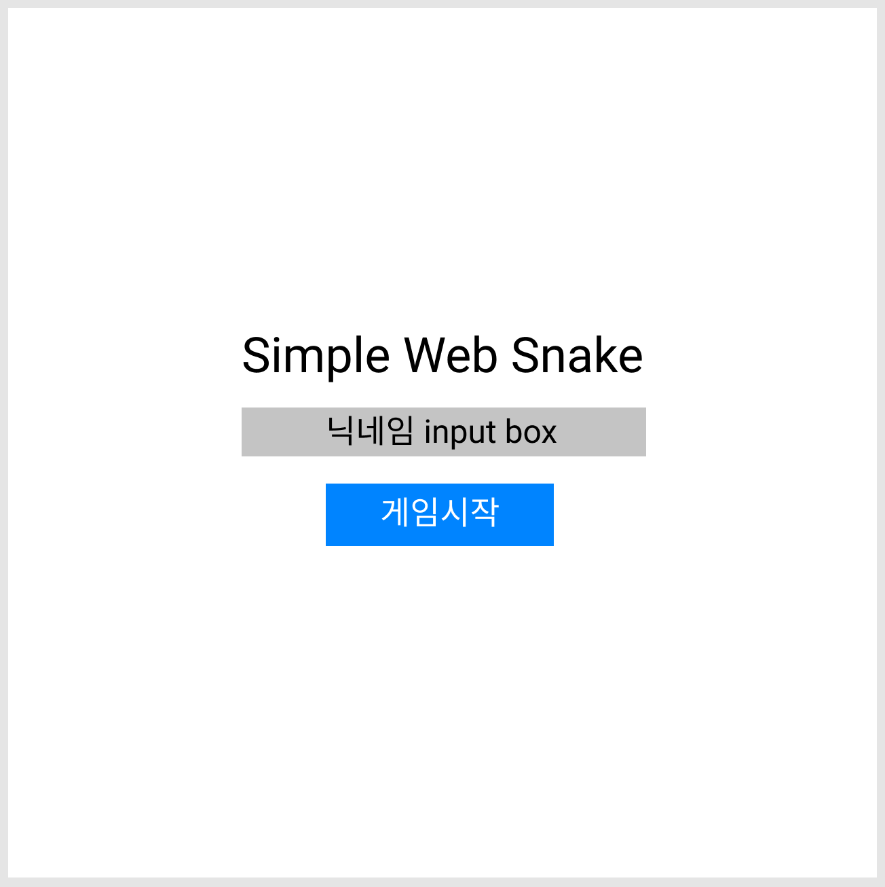
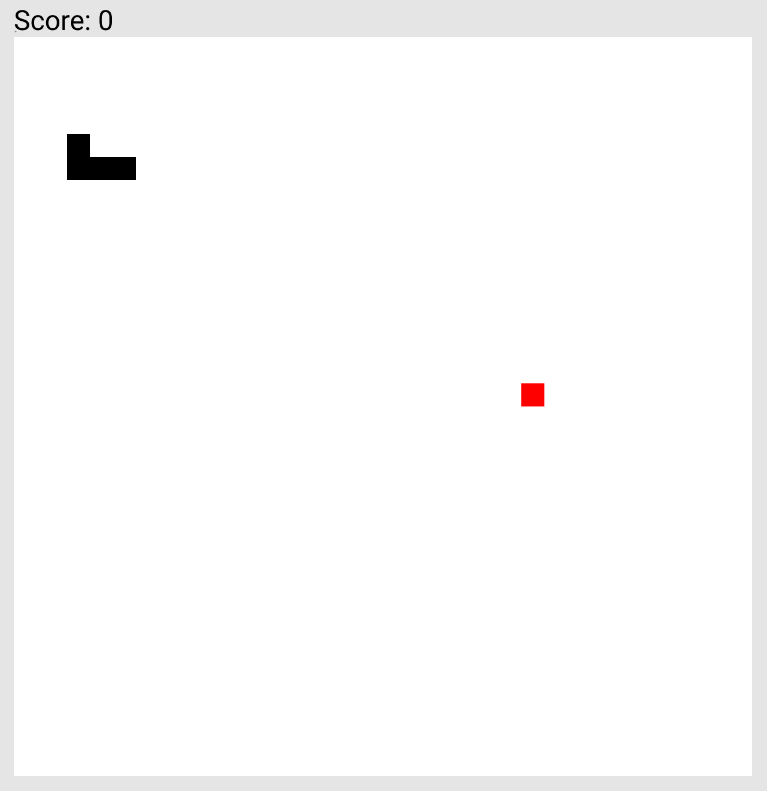
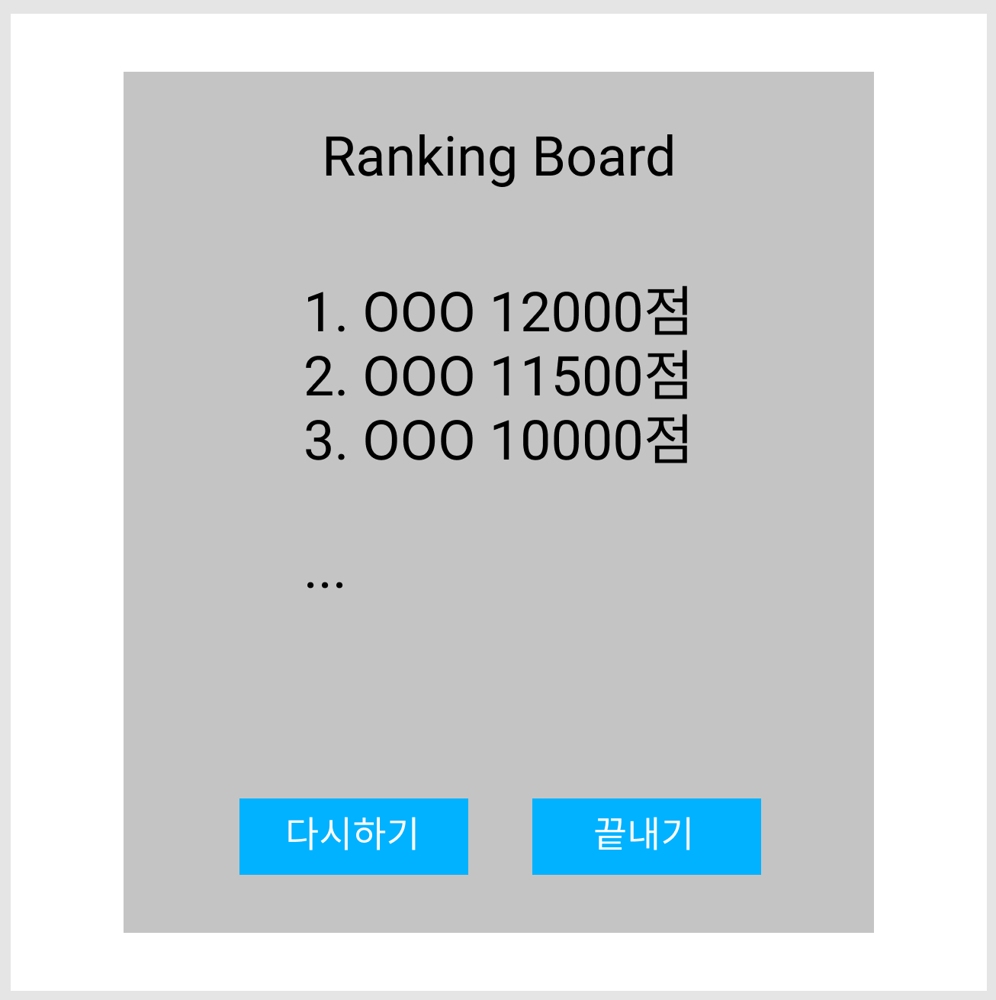

# Snake 게임 설계

## 기본 화면 구조

### 조건
1. 사방이 막혀있는 네모난 공간에 조종 가능한 뱀 한 마리가 놓여진다.
2. 뱀은 현재 머리가 향하고 있는 방향으로 멈추지 않고 이동한다.
3. 플레이어는 조작으로 머리가 진행하는 방향만 바꿀 수 있다.
4. 뱀이 벽이나 자신의 몸 일부에 머리를 부딪히면 죽는다.
5. 목적은 최대한 화면에 놓여있는 먹이를 먹어 길이를 늘리는 것이다.
6. 먹이를 먹을 때 마다 뱀의 길이가 길어지고 점수가 올라간다.
7. 일정 시간이 지나면 속도가 점점 증가한다.
8. 진행하는 방향의 반대로 이동할 수 없다.
9. 먹이는 뱀과 겹치지 않게 랜덤으로 생성된다.
10. 서버에 저장된 점수는 게임이 종료되면 순위에 맞게 그려진다.

### 초기 화면 구성
1. Start

- 게임 타이틀, 닉네임 input box, 게임시작 버튼으로 구성된다.
- 게임 시작 버튼을 클릭하면 게임 화면으로 텍스트와 버튼이 사라지고 게임이 시작된다.

2. Game

- 검은색은 뱀, 빨간색은 사과를 의미한다.
- 최상단에 현재 유저의 점수를 그려준다.
- 점수는 게임진행 시간과 뱀의 길이를 합산하여 계산한다.
- 벽 혹은 몸과 충돌시 게임 종료화면으로 넘어간다.

3. End

- 현재 랭킹 보드를 중앙에 출력한다.
- 다시시작, 끝내기를 선택할 수 있다.
- 다시시작은 Game 화면으로 돌아간다.
- 끝내기는 Start 화면으로 돌아간다.

## 필수 함수

1. 방향키 입력을 받을 함수
  - 상하좌우 키를 입력하면 스네이크 방향을 변경한다.
  - 진행방향의 반대키는 제한을 건다.

2. 사과를 추가할 함수
  - 랜덤으로 맵안에 사과를 생성한다.
  - 스네이크와 충돌할 시 랜덤 생성된다.
  - 이때 스네이크와 겹치지 않게 생성할 수 있도록 체크한다.

3. 게임 스타트 함수
  - 스타트 화면을 보여준다. (가장 초기화면)
  - 닉네임을 입력하고 버튼을 클릭하면 스타트 화면을 지우고 게임화면을 보여준다.
  - 닉네임에 빈칸이 없는지 체크한다.

4. 게임 종료 함수
  - 게임 화면을 지우고 랭킹보드가 있는 종료 화면을 보여준다.
  - 다시하기 버튼을 클릭할 시 게임을 호출한다.
  - 끝내기 버튼을 클릭할 시 게임 스타트 화면으로 돌아간다.

5. 충돌 감지 함수
  - 사과와 충돌할 시 스네이크의 길이를 늘린다.
  - 벽과 충돌할 시 게임 종료 함수를 호출한다.
  - 해당 유저의 정보와 점수를 서버로 전송한다.

6. 저장된 순위를 출력할 함수
  - 서버에 저장된 점수를 받아 순위대로 화면에 그려준다.

7. 스네이크를 움직일 함수
  - 입력 받은 방향키를 인식하여 해당 방향으로 스네이크를 움직인다.

8. 스네이크를 그려줄 함수
  - 진행 방향에 따라 스네이크를 계속해서 그려준다.
  - 스네이크 머리의 위치를 기억한다.
  - 스네이크 머리의 위치를 따라 몸통을 그려준다.