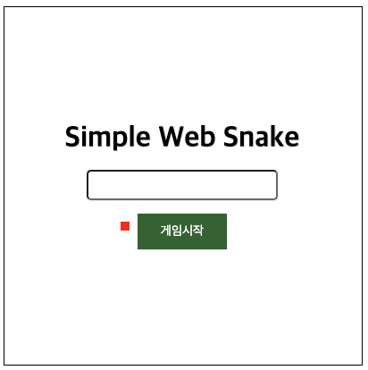

안녕하세요! ZiPIDA 연구원 Shark입니다.

첫 입사를 하고 순차적으로 신입 개발자를 위한 OJT와 Test Project를 꾸준히 진행하면서 벌써 마지막 Test Project를 끝마쳤습니다.

오늘은 마지막 Test Project인 Snake 게임 개발을 하면서 그 과정과 생겼던 문제들 그리고 고민했던 부분들에 대해서 정리하려고 합니다.

## Sanke

### 사용된 기술
- Javascript
- Canvas API
- Node.js
- Docker
- Mocha를 이용한 TDD 경험

마지막 Test Project의 목적은 아래와 같습니다.
- 캔버스 드로잉 방법 이해
- 게임 알고리즘을 테스트케이스 작성
- 점수 시스템 기획과 서버 개발
- 도커 환경 구성

### 처음 마주한 게임 보일러 플레이트

총 8개의 파일이 제공되며, 수정 불가, 수정 가능, 일부 수정 가능 등의 제약사항이 있었습니다.

하지만 제약사항을 제외한 부분은 모두 자유롭게 개발이 가능한 프로젝트였습니다.

### 들어가기에 앞서
보일러 플레이트 소스 파일들에 대한 이해가 어느 정도 필요한 Test Project 였습니다.

작성된 게임 프레임워크의 구조를 이해하기 위해서,

직접 구동 및 테스트를 해보고 소스 코드를 조금씩 수정해봤습니다.

### 화면에 대한 고민

간단하게 게임 화면 구성에 대해 고민해보고 프로토타입 디자인을 만들었습니다.

Simple Web Game이라는 프로젝트에 걸맞게 간단한 화면 구성으로 디자인했습니다.

1. 초기 게임 시작 화면


- 타이틀
- 닉네임을 입력 Box
- 게임 시작을 위한 버튼

2. 초기 게임 화면


- 최상단 점수 및 닉네임
- 게임 Canvas 영역

3. 초기 게임 오버 화면


- 랭킹 보드
- 다시하기 및 끝내기 버튼

### Snake 게임 설계
스네이크 게임의 기본적인 조건부터 확인하고 진행했습니다.

1. 사방이 막혀있는 네모난 공간에 조종 가능한 스네이크가 존재한다.
2. 스네이크는 현재 머리가 향하는 방향으로 멈추지 않고 이동한다.
3. 플레이어는 방향키로 머리가 진행하는 방향만 바꿀 수 있다.
4. 스네이크가 벽이나 자신의 몸 이불에 머리를 부딪치면 게임 오버된다.
5. 목적은 최대한 화면에 생성된 사과를 먹어 길이를 늘리는 것이다.

위의 조건을 토대로 필수적으로 필요한 함수들을 먼저 설계했습니다.

필수 함수 아래에 들어갈 기능을 예상하여 간단하게 정리했습니다.

1. 방향키 입력을 받을 함수
  - 상하좌우 키를 입력하면 스네이크 머리 방향을 바꾼다.
  - 진행 방향의 반대키는 제한을 건다.
2. 사과를 추가할 함수
  - 랜덤으로 맵 안에 사과를 생성한다.
  - 스네이크와 충돌할 시 랜덤 생성된다.
  - 스네이크와 겹치지 않게 생성할 수 있도록 체크한다.
3. 게임 스타트 함수
  - 스타트 화면을 보여준다.
  - 닉네임을 입력받고, 스타트 버튼을 누르면 게임 화면을 보여준다.
  - 닉네임에 빈칸이 없는지 간단한 조건을 체크한다.
4. 게임 종료 함수
  - 게임 화면을 지우고 랭킹 보드가 있는 종료 화면을 보여준다.
  - 유저의 이름과 점수를 서버로 보내고 결과를 받아 그려준다.
  - 다시 하기 버튼을 클릭할 시 게임을 호출한다.
  - 끝내기 버튼을 클릭할 시 게임 스타트 화면으로 돌아간다.
5. 충돌 감지 함수
  - 사과와 충돌할 시 스네이크 길이와 점수를 늘린다.
  - 벽과 충돌할 시 게임 종료 함수를 호출한다.
  - 머리와 몸이 충돌할 시 게임 종료 함수를 호출한다.
6. 저장된 순위를 출력할 함수
  - 서버에 저장된 점수를 높은 점수 순서로 정렬하여 보여준다.
7. 스네이크를 움직일 함수
  - 스네이크가 해당 방향으로 이동할 수 있게 한다.
8. 스네이크를 그려줄 함수
  - 진행 방향에 따라 스네이크를 계속 그려준다.
  - 스네이크의 머리 위치를 기억한다.
  - 스네이크의 머리 위치를 따라 몸을 그려준다.
  - 사과를 그려준다.

해당 함수들을 기반으로 테스트케이스 작성에 들어갔습니다.

```js
// 테스트케이스 일부 예시
describe('방향 테스트', function() {
  it('왼쪽 화살표를 누르면 다음 방향이 W가 된다.', function() {
    move('ArrowLeft');
    assert.deepEqual('W', snakeObject.beforeDirection);
  });
  it('아래쪽 화살표를 누르면 다음 방향이 S가 된다.', function() {
    move('ArrowDown');
    assert.deepEqual('S', snakeObject.beforeDirection);
  });
  it('오른쪽 화살표키를 누르면 다음 방향이 E가 된다.', function() {
    move('ArrowRight');
    assert.deepEqual('E', snakeObject.beforeDirection);
  });
  it('위쪽 화살표키를 누르면 다음 방향이 N이 된다.', function() {
    move('ArrowUp');
    assert.deepEqual('N', snakeObject.beforeDirection);
  });
  it('머리 방향이 위쪽일때 반대방향인 아래쪽을 누르면 아무 변화가 없다.', function() {
    move('ArrowDown');
    assert.deepEqual('N', snakeObject.beforeDirection);
  })
});
```

위 테스트케이스를 예로,

`move()`라는 스네이크의 머리 방향을 정해줄 빈 함수가 있습니다.

처음 테스트케이스를 실행하면 해당 조건에 맞지 않아 실패합니다.

입력받은 키에 해당하는 조건이 정상적으로 실행되고,

테스트케이스를 통과하는 조건으로 개발에 들어갔습니다.

## 본격적인 개발 시작
###### 저는 아직 몰랐습니다. 
###### 앞으로 어떤 일이 일어날지....

`snake.js` 소스 파일을 기반으로 스네이크 게임에 대한 로직을 작성하기 시작했습니다.

최대한 제공된 소스 파일을 벗어나지 않는 범주에서 개발에 들어갔습니다.

먼저 TDD 주도 개발을 위해 작성된 테스트케이스를 통과시킬 함수를 작성했습니다.

### 방향을 바꿔봅시다.

```js
// 이 아이는 머리 방향을 정해줍니다!
function move(key) {
  if (key === 'ArrowUp' && !snakeObject.direction = 'S') {
    snakeObject.direction = 'N';
  } else if (key === 'ArrowDown' && !snakeObject.direction = 'N') {
    snakeObject.direction = 'S';
  } else if (key === 'ArrowLeft' && !snakeObject.direction = 'E') {
    snakeObject.direction = 'W';
  } else if (key === 'ArrowRight' && !snakeObject.direction = 'W') {
    snakeObject.direction = 'E';
  }
}
```

`snakeObject`의 `direction`은 현재 스네이크의 방향을 뜻합니다.

입력된 키에 해당 머리 방향을 변경해주는 간단한 함수를 만들었습니다.

조건문에 입력받은 키가 현재 방향의 반대 방향이 아닐 때 동작하게 제약을 걸었습니다.

진행 방향과 반대 방향을 허용한다면 스네이크가 자신의 몸을 투과하거나 충돌 체크 시 바로 게임오버 요소가 될 수 있기 때문입니다.

초기 소스 코드에서 길이를 담당하는 `size`만 변경했을 때 해당 좌표에 맞게 꼬리 부분이 머리 뒤쪽으로 새로 그려지는 것을 확인했습니다.
###### 이때 무언가 잘못되었음을 알았어야 했습니다.

### 해당 방향으로 자동으로 움직여봅시다.

```js
// 여기서 정리된 스네이크가
function snake({ ctx }) {
  if (snakeObject.direction === 'W') {
    snakeObject.pos.x -= gameConfig.size;
  } else if (snakeObject.direction === 'E') {
    snakeObject.pos.x += gameConfig.size;
  } else if (snakeObject.direction === 'N') {
    snakeObject.pos.y -= gameConfig.size;
  } else if (snakeObject.direction === 'S') {
    snakeObject.pos.y += gameConfig.size;
  }
  renderSnake({ ctx, snake: snakeObject, color: '#5c9a63' });
}
```

```js
// 여기서 그려집니다.
function renderSnake({ ctx, snake, color }) {
  const { direction, beforeDirection } = snake;
  let { x, y } = snake.pos;
  let { x: changeX, y: changeY } = snake.changePos;
  for (let f = 0; f <= (snake.size - 1) * gameConfig.size; f ++) {
    let posX = x;
    let posY = y;
    if (direction === 'E')  {
      posX = x - f;
    } else if (direction === 'W') {
      posX = x + f;
    } else if (direction === 'S') {
      posY = y - f;
    }
    drawRect({ ctx, x: posX, y: posY, width: gameConfig.size, height: gameConfig.size, color });
  }
}
```

상하좌우 방향에 맞게 해당 좌표로 이동하게 됩니다.

`gameConfig.size`는 설정 파일로 기본 게임 오브젝트 사이즈로 10*10입니다.

따라서 해당 스네이크는 10*10칸을 기준으로 움직이게 됩니다.

### 먹이를 추가해 봅시다.
```js
const apple = {x: 0, y: 0};

function appleMake() {
  apple.x = Math.floor(Math.random() * (gameConfig.width / gameConfig.size)) * gameConfig.size;
  apple.y = Math.floor(Math.random() * (gameConfig.width / gameConfig.size)) * gameConfig.size;
}
```

`appleMake()` 함수는 게임 크기를 벗어나지 않게 랜덤으로 좌표를 생성해줍니다.

즉, 스네이크가 사과와 충돌하는 조건을 걸면 다음 사과가 랜덤좌표를 생성하게 됩니다.

### 충돌을 체크해 봅시다.
```js
function crashCheck() {
  // Canvas Size 400 * 400
  if(snakeObject.pos.x < 0 || snakeObject.pos.x > 390) {
    console.log('충돌했어요!');
  }
  if(snakeObject.pos.y < 0 || snakeObject.pos.y > 390) {
    console.log('충돌했어요!');
  }
    if(snakeObject.pos.x === apple.x && snakeObject.pos.y === apple.y) {
    console.log('먹었어요!');
    snakeObject.size += 1;
    appleMake();
  }
}
```
스네이크의 x, y 좌표와 벽의 x, y 좌표,

그리고 사과의 현재 x, y 좌표 까지 전부 충돌 체크 함수에 넣었습니다.

테스트 결과 정상적으로 콘솔로그가 출력되고, 충돌 체크도 완료했습니다.

### 우리 스네이크가 이상해요...

화면에 그려지는 부분만 신경쓰다 보니 뭔가 이상함을 느꼈습니다.

현재 소스 코드에서는 해당 머리 방향에 맞게 `size` 만큼 머리 뒷 부분으로 몸이 그려집니다.

즉, 사과를 먹으면 길이가 정상적으로 길어지지만, 방향을 바꿀 때마다, 

스네이크가 각목처럼 머리 뒤에 몸이 딱 붙어서 움직이게 됩니다.

###### 축하합니다. 방향키로 움직이는 시곗바늘을 만들었습니다!

### 처음부터 다시 해봅시다.

며칠을 고민하고 새로운 시도를 했습니다.

스네이크 몸의 움직임에 신경을 쓰다 보니 처음 목적이었던 TDD 주도 개발과 멀어지게 되었습니다.

결국 처음으로 리셋하여 다시 시작해보기로 했습니다.

많은 부분이 조금씩 변경되었습니다.

순차적으로 스네이크를 담아 줄 배열을 만들었습니다.

```js
// 스네이크 배열
const body = [{x: 200, y: 200}]; // 0번 인덱스는 머리가 된다.
```

걸맞게 충돌 함수도 변경되었습니다.
```js
function crashCheck() {
  // 스네이크 배열 인덱스 0 은 머리입니다.
  if(body[0].x < 0 || body[0].x > 390) {
    console.log('충돌했어요!');
  }
  if(body[0].y < 0 || body[0].y > 390) {
    console.log('충돌했어요!');
  }
    if(body[0].x === apple.x && body[0].x === apple.y) {
    console.log('먹었어요!');
    body.push({x: body[0].x, y: body[0].y});
    appleMake();
  }
}
```

`snakeObject.pos` 가 담당하던 부분들이 스네이크 머리가 될,

`body` 배열의 0번째 인덱스 좌표로 변경되었습니다.

배열로 변경하고 그려주는 부분도 간단하게 수정되었습니다.

```js
function renderSnake({ ctx, snake, color }) {
  for (let f = 0; f < body.length; f ++) {
    crashCheck(snake.body[0].x, snake.body[0].y);

    // 스네이크의 머리와 몸을 구분해서 그려준다.
    if (f === 0) {
      drawRect({ ctx, x: snake.body[f].x, y: snake.body[f].y, width: gameConfig.size, height: gameConfig.size, color: '#104216' });
    } else {
      drawRect({ ctx, x: snake.body[f].x, y: snake.body[f].y, width: gameConfig.size, height: gameConfig.size, color });
    }
    drawRect({ ctx, x: apple.x, y: apple.y, width: gameConfig.size, height: gameConfig.size, color: 'red'});
  }
}
```

스네이크 배열의 길이를 순회하며 해당 인덱스에 담긴 좌표를 불러와 그려주게 되었고 머리와 몸을 구분하기 위해 색을 달리했습니다.

이제 스네이크 머리를 따라 몸이 자연스럽게 움직이게 되었습니다.

머리를 최신화하기 위해서는 머리가 항상 앞에 유지되어야 합니다.

`Javascript`에서 `Array` 메소드인 `unshift()`를 이용했습니다.

unshift는 새로운 요소를 배열 앞에 추가하고 새로운 길이를 반환합니다.

`body.unshift({x: body[0].x, y: body[0].y})`

머리가 항상 0번째 인덱스가 되었습니다!

해당 부분을 스네이크를 그려주는 함수에 넣어 계속 실행되게 해주면

10*10 size를 기준으로 진행 방향에 맞춰 좌표들이 배열에 순차적으로 업데이트가 됩니다.

순차적으로 업데이트되면서 화면에 그려질 때 머리를 따라 몸이 그려지게 됩니다.

배열의 각각 인덱스에 해당 좌표들의 업데이트를 제외한다면 몸이 추가됐던 자리에 계속 머물러 있게 됩니다.

하지만 unshift만 쓴다면 스네이크가 꾸준히 길어질 뿐입니다.

`Array` 메소드인 `pop()`을 이용하여 마지막 인덱스 요소를 제거해 줍니다.

`body.pop()`을 해당 코드 아래 넣어주면 길이를 계속 유지하게 됩니다.


### 새로운 버그가 생겼습니다.

스네이크가 자연스럽게 움직이면서 속도가 붙기 시작했습니다.

~~왜냐하면 테스트 마감기한이 코앞으로 왔기 때문입니다.~~

화면을 그려주는 부분까지 완성하게 되었습니다.




화면은 Client 측 JS 파일이 로드될 때 동적으로 그려지게 작성했고,

조건에 맞는 화면을 보여줄 수 있게 만들었습니다.

너저분한 코드들을 최대한 정리하고 해당 기능들이 잘 작동되는지 확인합니다.

이제 드디어 끝을 향해 달려가고 있었습니다.

하지만 여기서 또 문제가 발생하게 됩니다.

1. 해당 사과는 독 사과 입니다.

```js
function crashCheck(headX, headY) {
  if (!gameOver) {
    if (headX < 0 || headX > gameConfig.width - 10) {
      gameEnd();
    }
    if (headY < 0 || headY > gameConfig.height - 10) {
      gameEnd();
    }
    // 여기와!
    for (let i = 0; i < snakeObject.body.length; i ++) {
      if (headX === snakeObject.body[i].x && headY === snakeObject.body[i].y) {
        gameEnd();
      }
    }
    // 여기서 문제 발생!!
    if (headX === snakeObject.apple.x && headY === snakeObject.apple.y) {
      snakeObject.score += 10 * snakeObject.body.length;
      scoreSpan.innerText = `score : ${snakeObject.score}`;
      appleMake();
      snakeObject.body.push({ x: snakeObject.body[0].x, y: snakeObject.body[0].y });
    }
  }
}
```

머리와 몸의 충돌을 확인하는 조건문에서 사과를 먹을 시,

새로 생성된 머리와 꼬리의 좌표가 업데이트 전과 동일하다 보니 게임오버가 돼버립니다!

`body.length -1` 로 순회 조건을 변경하면 오류는 없습니다.

다만 머리가 꼬리와 충돌했을 때 뚫고 지나간다든지,

게임 오버가 되어야 하는데 무적 치트키처럼 게임이 진행된다든지,

의 새로운 버그가 생길 뿐입니다.

`snakeObject.body.push` 부분을 `snakeObject.body.unshift` 로 수정했습니다.

스네이크의 한 부분이 10x10의 크기이고 Canvas의 크기가 400x400 사이즈입니다.

스네이크의 길이가 4를 넘기 전까지는 충돌이 발생할 수 없습니다.

0번째 인덱스와 1번째 인덱스를 넘겨서 순회하는 조건으로 변경했습니다.

```js
    // 이제 사과는 안전합니다.

    // 머리와 목은 제외하고 순회한다. (길이 4까지는 충돌이 원래 없다.)
    for (let i = 2; i < snakeObject.body.length; i ++) {
      if (headX === snakeObject.body[i].x && headY === snakeObject.body[i].y) {
        gameEnd();
      }
    }

    if (headX === snakeObject.apple.x && headY === snakeObject.apple.y) {
      snakeObject.score += 10 * snakeObject.body.length;
      scoreSpan.innerText = `score : ${snakeObject.score}`;
      appleMake();
      snakeObject.body.unshift({ x: snakeObject.body[0].x, y: snakeObject.body[0].y });
    }
  }
}
```

2. 스네이크 몸과 사과 겹침 발생

사과 좌표가 랜덤으로 생성됩니다.

그래서 테스트 때 마다 문제없이 잘 생성되었습니다.

사과가 랜덤으로 생성될 시 맵 밖에서 생성되지 않았습니다.

하지만 게임이 손에 익으면서 오래 생존하다 보니 스네이크 몸이 갑자기 빨갛게 물들었습니다.

```js
function appleMake() {
  snakeObject.newApple.x = Math.floor(Math.random() * (gameConfig.width / gameConfig.size)) * gameConfig.size;
  snakeObject.newApple.y = Math.floor(Math.random() * (gameConfig.height / gameConfig.size)) * gameConfig.size;
  for (let i = 0; i < snakeObject.body.length; i ++) {
    if (snakeObject.body[i].x !== snakeObject.newApple.x && snakeObject.body[i].y !== snakeObject.newApple.y) {
      snakeObject.apple = snakeObject.newApple;
    } else {
      // 겹치면 새로 다시 랜덤으로 생성
      snakeObject.newApple.x = Math.floor(Math.random() * (gameConfig.width / gameConfig.size)) * gameConfig.size;
      snakeObject.newApple.y = Math.floor(Math.random() * (gameConfig.height / gameConfig.size)) * gameConfig.size;
    }
  }
}
```
사과가 스네이크의 몸 일부분과 좌표가 겹치지 않을 때에 생성될 수 있게 변경해줘야 합니다.

새로 그려질 사과의 좌표를 담을 `newApple` 변수를 만들었고,

스네이크 몸을 순회하며 x, y 좌표와 새로 랜덤 생성된 사과의 x, y 좌표를 비교하며 해결했습니다.

겹치면 다시 랜덤 좌표를 생성하고 그렇지 않으면 사과를 화면에 그려줍니다.

3. 게임 오버가 됐는데 스네이크가 움직인다.

랭킹 보드가 떴지만, 열심히 화면 뒤에서 스네이크가 움직입니다.

심지어 다시 하기, 끝내기 버튼을 누르고 게임을 실행시키면 바로 게임 오버가 됩니다.

`gameOver = false;`

게임 오버를 체크해줄 변수를 만들어 `false` 조건일 때만 게임이 가능하게 변경하고,

`true` 조건일 시 키보드 입력을 막는 약간의 제약을 걸었습니다.

새로운 게임과 다시 시작을 위해 `reset()` 함수를 만들어 스네이크 오브젝트를 초기화시켜줬습니다.

### 랭킹을 만들어봅시다.

이제 게임은 어느 정도 마무리가 되었다고 판단하고 랭킹 제작에 들어갔습니다.

Node.js 서버에서

```js
app.post('/rank', (request, response) => {
  const logDate = new Date();
  const { name, score } = request.body;
  if (Number.isInteger(score) && score > 0 && name !== '') {
    console.log(`New Log : ${name}, ${score} : ${logDate}`);
    rank.push({ name, score });
    response.send(rank);
  }
});
```

받아온 랭킹 데이터를 서버 측 배열에 순차적으로 저장하고 그 배열을 다시 클라이언트 측에 보내주는 방식으로 제작하였습니다.

클라이언트 측에서는 게임 오버 발생 시 해당 유저의 데이터를 서버로 보내게 됩니다.

```js
  fetch('/rank', {
    method: 'POST',
    headers: {
      'Content-Type': 'application/json',
    },
    body: JSON.stringify({ name, score: snakeObject.score }),
  })
    .then((res) => res.json())
    .then((json) => ranking(json));
```

해당 유저의 데이터를 보내고 서버에서 저장하고 업데이트된 새로운 랭킹 데이터를 받아옵니다.

랭킹 데이터가 동적으로 생성되는데 이때 중복 생성을 방지하기 위해

```js
function ranking(json) {
  // 랭킹을 초기화 후 새로 그려준다.
  while (rankDiv.hasChildNodes()) {
    rankDiv.removeChild(rankDiv.firstChild);
  }

  // 점수가 높은 순으로 내림차순 정렬
  json.sort((a, b) => b.score - a.score);

  json.forEach((e, i) => {
    const rankSpan = document.createElement('span');
    rankSpan.setAttribute('class', 'rank-span');
    rankSpan.innerText = `${i + 1} . ${e.name} ${e.score}점`;
    rankDiv.appendChild(rankSpan);
  });
}
```

해당 랭킹 데이터를 초기화하고 다시 동적으로 생성해주는 방식으로 변경했습니다.

배열에 담긴 점수들은 점수와 관계없이 순서대로 저장되어 있습니다.

간단하게 처리하기 위해 `sort()` 함수를 이용해 높은 순인 내림차순으로 정렬해 줬습니다.

정렬된 배열을 순차적으로 순회하며 화면에 그려주게 됩니다.

게임과 관련된 부분은 이렇게 완성이 되었습니다.

시작은 마지막 Test Project이고, 스네이크 게임을 플레이해본 경험이 있어 금방 제작할 줄 알았습니다.

하지만 예상치 못한 변수들로 인해 당황하다 보니 시간이 촉박해져 여기저기서 문제가 발생했고,

TDD 주도 개발도 개인적인 생각으로 많이 벗어났다고 느낍니다.

그래도 완성을 해서 뿌듯하면서 앞으로 보완해야 할 부분을 생각하게 되었습니다.

평소 좋아하는 게임을 직접 만들어 본다는 경험에 재미있는 프로젝트였습니다.

끝으로는 Dockerfile을 작성했습니다.

Snake 프로젝트를 Build 하여 만들어진 Image를 Docker Hub에 Push 하고,

AWS 서버에서 접속하여 Image 파일을 Pull 받고 `docker run` 명령어를 통해 컨테이너를 띄워서 게임을 서비스하는 것으로 Test Project가 끝나게 됩니다.

현재 진행형으로 수정이 필요한 부분에 대해서 업데이트가 진행될 예정입니다.